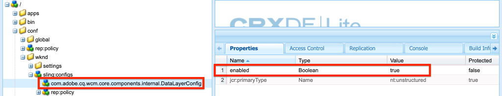

# 搭配核心元件使用Adobe用戶端資料層 {#data-layer-core-components}

Adobe用戶端資料層的目標，是透過提供標準化方法來公開和存取任何指令碼的任何類型資料，以減少網站的測試工作。

Adobe用戶端資料層不受平台限制，但已完全整合至核心元件，可與AEM搭配使用。

和核心元件一樣，GitHub也提供Adobe用戶端資料層的程式碼及其開發人員檔案。 本檔案概述核心元件與資料層的互動方式，但GitHub檔案會延遲完整的技術詳細資訊。

>[!TIP]
>
>有關Adobe客戶端資料層的詳細信 [息，請參閱其GitHub儲存庫中的資源。](https://github.com/adobe/adobe-client-data-layer)
>
>如需Adobe用戶端資料層與核心元件整合的詳細技術資訊，請參閱核心元 [`DATA_LAYER_INTEGRATION.md`](https://github.com/adobe/aem-core-wcm-components/blob/master/DATA_LAYER_INTEGRATION.md) 件儲存庫中的檔案。

## 安裝與啟動 {#installation-activation}

自2.9.0版起，資料層會以AEM用戶端程式庫的形式與核心元件一併分發，而不需安裝。 依預設， [AEM Project Archetype v. 24+產生的所有專案都包含已啟動的「資料層](/help/developing/archetype/overview.md) 」。

若要手動啟動資料層，您必須為其建 [立內容感知組態](/help/developing/context-aware-configs.md) :

1. 在資料夾下方建 `/conf/<mySite>` 立下列結 `<mySite>` 構，其中是您網站專案的名稱：
   * `/conf/<mySite>/sling:configs/com.adobe.cq.wcm.core.components.internal.DataLayerConfig`
   * 其中每個節點都 `jcr:primaryType` 設定為 `nt:unstructured`。
1. 新增名為的布林屬 `enabled` 性，並將其設為 `true`。

   

   *DataLayerConfig在WKND參考網站中的位置*

1. 將屬 `sling:configRef` 性新增至下 `jcr:content` 方網站的節 `/content` 點(例如 `/content/<mySite>/jcr:content`)，並從上一 `/conf/<mySite>` 步設定為。

1. 啟用後，您可以在編輯器外載入網站的頁面來驗證啟動。 檢查頁面來源，標 `<body>` 記應包含屬性 `data-cmp-data-layer-enabled`

   ```html
   <body class="page basicpage" id="page-id" data-cmp-data-layer-enabled>
       <script>
         window.adobeDataLayer = window.adobeDataLayer || [];
         adobeDataLayer.push({
             page: JSON.parse("{\x22page\u002D6c5d4b9fdd\x22:{\x22xdm:language\x22:\x22en\x22,\x22repo:path\x22:\x22\/content\/wknd\/language\u002Dmasters\/en.html\x22,\x22xdm:tags\x22:[],\x22xdm:template\x22:\x22\/conf\/wknd\/settings\/wcm\/templates\/landing\u002Dpage\u002Dtemplate\x22,\x22@type\x22:\x22wknd\/components\/page\x22,\x22dc:description\x22:\x22WKND is a collective of outdoors, music, crafts, adventure sports, and travel enthusiasts that want to share our experiences, connections, and expertise with the world.\x22,\x22dc:title\x22:\x22WKND Adventures and Travel\x22,\x22repo:modifyDate\x22:\x222020\u002D09\u002D29T07:50:13Z\x22}}"),
             event:'cmp:show',
             eventInfo: {
                 path: 'page.page\u002D6c5d4b9fdd'
             }
         });
       </script>
   ```

1. 您也可以開啟瀏覽器的開發人員工具，並在主控台中 `adobeDataLayer` 提供JavaScript物件。 輸入以下命令以獲取當前頁面的資料層狀態：

   ```js
   window.adobeDataLayer.getState();
   ```

## 核心元件資料結構 {#data-schemas}

以下是核心元件與資料層一起使用的方案清單。

### 元件／容器項目結構 {#item}

元件／容器項模式用於以下元件：

* [階層連結](/help/components/breadcrumb.md)
* [按鈕](/help/components/button.md)
* [語言導覽](/help/components/language-navigation.md)
* [清單](/help/components/list.md)
* [導覽](/help/components/navigation.md)
* [Teaser](/help/components/teaser.md)
* [文字](/help/components/text.md)
* [標題](/help/components/title.md)

元件／容器項方案定義如下。

```javascript
id: {                   // component ID
    @type               // resource type
    repo:modifyDate     // last modified date
    dc:title            // title
    dc:description      // description
    xdm:text            // text
    xdm:linkURL         // link URL
    parentId            // parent component ID
}
```

下列事 [件與](#events) 「元件／容器項目」結構相關：

* `cmp:click`

### 頁面結構 {#page}

頁面架構由下列元件使用：

* [頁面](/help/components/page.md)

頁面結構定義如下。

```javascript
id: {
    @type
    repo:modifyDate
    dc:title
    dc:description
    xdm:text
    xdm:linkURL
    parentId
    xdm:tags            // page tags
    repo:path           // page path
    xdm:template        // page template
    xdm:language        // page language
}
```

頁面 `cmp:show` 載入時會觸發事件。 此事件會從緊接在開頭標籤下方的串聯JavaScript中 `<body>` 傳送，成為資料層事件佇列中最早的事件。

### 容器結構 {#container}

Container架構由下列元件使用：

* [折疊式面板](/help/components/accordion.md)
* [索引標籤](/help/components/tabs.md)
* [傳送](/help/components/carousel.md)

容器結構描述的定義如下。

```javascript
id: {
    @type
    repo:modifyDate
    dc:title
    dc:description
    xdm:text
    xdm:linkURL
    parentId
    shownItems          // array of the displayed item IDs
}
```

下列事 [件](#events) ，與容器架構相關：

* `cmp:click`
* `cmp:show`
* `cmp:hide`

### 影像結構 {#image}

以下元件使用映像模式：

* [影像](/help/components/image.md)

映像模式定義如下。

```javascript
id: {
    @type
    repo:modifyDate
    dc:title
    dc:description
    xdm:text
    xdm:linkURL
    parentId
    image               // asset detail (see below section)
}
```

下列事 [件](#events) ，與影像架構相關：

* `cmp:click`

### 資產結構 {#asset}

Asset架構用於 [Image元件內。](/help/components/image.md)

資產結構定義如下。

```javascript
id: {
    repo:id             // asset UUID
    repo:path           // asset path
    @type               // asset resource type
    xdm:tags            // asset tags
    repo:modifyDate
}
```

以下事 [件與](#events) 「資產」結構相關：

* `cmp:click`

## 核心元件事件 {#events}

核心元件會透過資料層觸發許多事件。 與資料層互動的最佳實務是 [註冊事件接聽器](https://github.com/adobe/adobe-client-data-layer/wiki#addeventlistener) ，然 ** 後根據觸發事件的事件類型和／或元件採取動作。 這將避免使用非同步指令碼的潛在競爭條件。

以下是AEM核心元件提供的現成可用事件：

* **`cmp:click`** -按一下可點按的元素(具有屬性的元 `data-cmp-clickable` 素)會使資料層觸發事 `cmp:click` 件。
* **`cmp:show`** 和 **`cmp:hide`** -控制accordion（展開／收合）、轉盤（下一個／上一個按鈕）和標籤（標籤選擇）元件會分別觸發資料層和 `cmp:show` 事件 `cmp:hide` 。 事件 `cmp:show` 也會在頁面載入時傳送，並預期會是第一個事件。
* **`cmp:loaded`** -當資料層填入頁面上的核心元件時，資料層就會觸發事 `cmp:loaded` 件。

### 元件觸發的事件 {#events-components}

下表列出觸發事件的標準核心元件以及這些事件。

| 元件 | 事件 |
|---|---|
| [折疊式面板](/help/components/accordion.md) | `cmp:show`與`cmp:hide` |
| [按鈕](/help/components/button.md) | `cmp:click` |
| [階層連結](/help/components/breadcrumb.md) | `cmp:click` |
| [傳送](/help/components/carousel.md) | `cmp:show`與`cmp:hide` |
| [語言導覽](/help/components/language-navigation.md) | `cmp:click` |
| [導覽](/help/components/navigation.md) | `cmp:click` |
| [頁面](/help/components/page.md) | `cmp:show` |
| [索引標籤](/help/components/tabs.md) | `cmp:show`與`cmp:hide` |
| [Teaser](/help/components/teaser.md) | `cmp:click` |

### 事件路徑資訊 {#event-path-info}

AEM核心元件所觸發的每個資料層事件都會包含包含下列JSON物件的裝載：

```json
eventInfo: {
    path: '<component-path>'
}
```

其中 `<component-path>` 是觸發事件之資料層中元件的JSON路徑。  值(可透過使 `event.eventInfo.path``adobeDataLayer.getState(<component-path>)` 用)很重要，因為它可當做參數使用，用來擷取觸發事件之元件的目前狀態，讓自訂程式碼存取其他資料並將其新增至資料層。

例如：

```js
function logEventObject(event) {
    if(event.hasOwnProperty("eventInfo") && event.eventInfo.hasOwnProperty("path")) {
        var dataObject = window.adobeDataLayer.getState(event.eventInfo.path);
        console.debug("The component that triggered this event: ");
        console.log(dataObject);
    }
}

window.adobeDataLayer = window.adobeDataLayer || [];
window.adobeDataLayer.push(function (dl) {
     dl.addEventListener("cmp:show", logEventObject);
});
```

## 教學課程

想要更詳細地探索資料層和核心元件嗎？ [查看本實作教學課程](https://docs.adobe.com/content/help/en/experience-manager-learn/sites/integrations/adobe-client-data-layer/data-layer-overview.html)。
