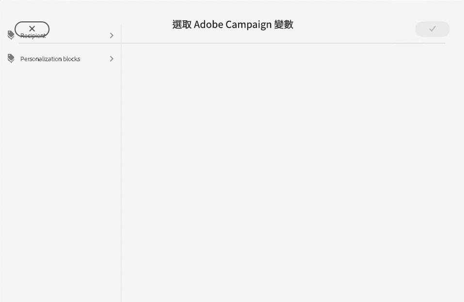
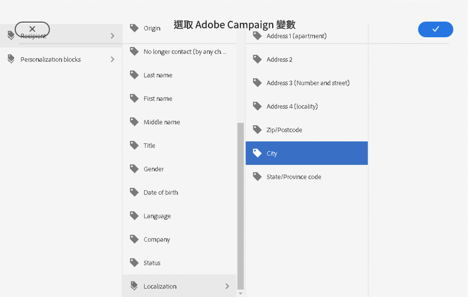
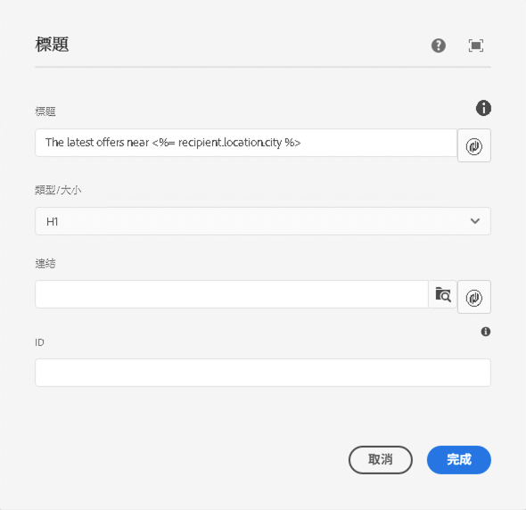

# 促銷活動變數 {#campaign-variables}

使用Campaign變數來撰寫個人化電子郵件內容。 行銷活動變數做為您可以插入電子郵件內容的Adobe Campaign值的預留位置。 透過Adobe Campaign傳送內容時，Campaign會以收件者的個人化內容取代這些變數。

## 使用情況 {#usage}

電子郵件核心元件可讓您透過常見文字欄位旁的個人化按鈕，輕鬆存取促銷活動變數。 按下時，會出現一個對話方塊，您可以從中選擇個人化欄位。

可用個人化欄位的清單已與您的Adobe Campaign執行個體同步。 這些欄位是在結構描述`nms:seedMember`的Adobe Campaign中管理的。 `nms:seedMember`中的所有欄位也必須出現在您的收件者資料表中。

## 選取Adobe Campaign變數對話方塊 {#dialog}

選取Adobe Campaign變數對話方塊可用於電子郵件核心元件的許多編輯對話方塊。 若要使用，只要按一下適用欄位旁的&#x200B;**選取Adobe Campaign變數**&#x200B;圖示即可。 此圖示有兩種形式。

按一下這兩個圖示會開啟&#x200B;**選取Adobe Campaign變數**&#x200B;對話方塊。

使用欄檢視來找出您要插入的變數。 按一下欄中的節點，會在右側的新欄中顯示其子系。 如此一來，您便可導覽可變內容結構。

選取您要插入的變數，然後按一下對話方塊右上角的核取記號。

已選取

然後，變數會插入電子郵件核心元件之編輯對話方塊的欄位中。

隨時按一下對話方塊左上方的X可取消並關閉對話方塊。
