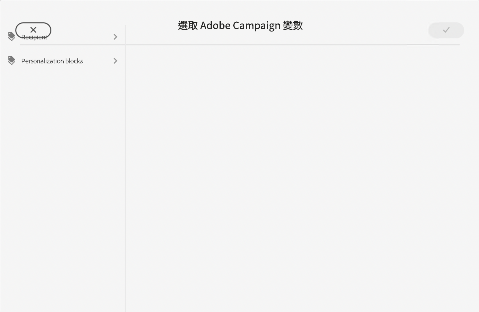
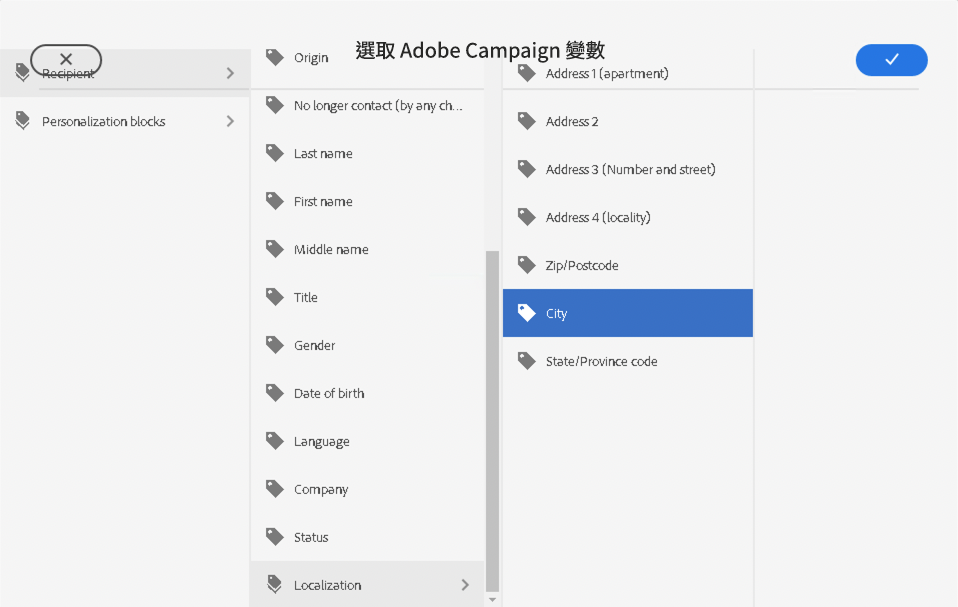
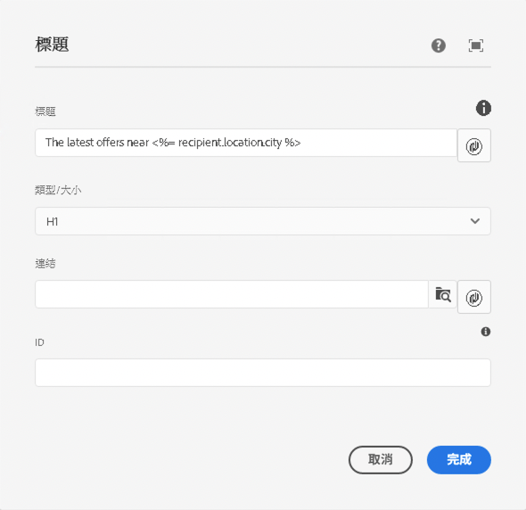

# Campaign 變數 {#campaign-variables}

使用 Campaign 變數來撰寫個人化電子郵件內容。 Campaign 變數作為 Adobe Campaign 值預留位置，可以插入至電子郵件內容。 透過 Adobe Campaign 傳送內容時，Campaign 會以收件者的個人化內容取代這些變數。

## 用途 {#usage}

「電子郵件核心元件」可讓您透過常見文字欄位旁的個人化按鈕，輕鬆存取 Campaign 變數。 按下時，會出現一個對話框，您可以從中選取個人化欄位。

可用的個人化欄位清單已與您的 Adobe Campaign 執行個體同步。 這些欄位是在結構描述 `nms:seedMember` 中管理的。 `nms:seedMember` 中的所有欄位也必須出現在您的收件者表格中。

## 選取 Adobe Campaign 變數對話框 {#dialog}

選取 Adobe Campaign 變數對話框可用於電子郵件核心元件的許多編輯對話框。 若要使用，只要按一下適用欄位旁的&#x200B;**選取 Adobe Campaign 變數**&#x200B;圖示即可。 此圖示有兩種形式。

按一下這兩個圖示會開啟&#x200B;**選取 Adobe Campaign 變數**&#x200B;對話框。

使用欄檢視來找出您要插入的變數。 按一下欄中的節點，會在右側的新欄中顯示其下層。 如此一來，您便可導覽變數內容結構。

選取您要插入的變數，然後按一下對話框右上角的核取記號。

然後，變數會插入電子郵件核心元件編輯對話框的欄位中。

隨時按一下對話框左上方的 X，即可取消並關閉對話框。
