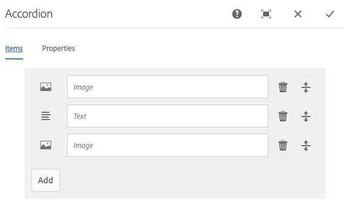

# Accordion Component{#accordion-component}

核心元件Accordion元件可讓您建立已排列在頁面上accordion中的面板集合。

## 使用狀況 {#usage}

The Core Component Accordion component allows for the creation of a collection of components, composed as panels, and arranged in an accordion on a page, similar to the [Tabs Component](tabs.md), but allows for expanding and collapsing of the panels.

* The accordion&#39;s properties can be defined in the [configure dialog](#configure-dialog).
* The order of the panels of the accordion can be defined in the configure dialog as well as the [select panel popover](#select-planel.md).
* Defaults for the Accordion Component when adding it to a page can be defined in the [design dialog](#design-dialog).

## Version and Compatibility {#version-and-compatibility}

目前版本的Accordion Component is v1，它是在2019年月發行的版本2.5.0推出的v1，本文中說明。

下表列出元件的所有支援版本、元件版本與元件相容的AEM版本，以及舊版文件的連結。

| 元件版本 | AEM6.3 | AEM6.4 | AEM6.5 |
|--- |--- |--- |---|
| v1 | 相容相容性 | 相容相容性 | 相容相容性 |

For more information about Core Component versions and releases, see the document [Core Components Versions](versions.md).

## Sample Component Output {#sample-component-output}

To experience the Accordion Component as well as see examples of its configuration options as well as HTML and JSON output, visit the [Component Library](http://opensource.adobe.com/aem-core-wcm-components/library/accordion.html).

## Technical Details {#technical-details}

The latest technical documentation about the Accordion Component [can be found on GitHub](https://github.com/adobe/aem-core-wcm-components/tree/master/content/src/content/jcr_root/apps/core/wcm/components/accordion/v1/accordion).

Further details about developing Core Components can be found in the [Core Components developer documentation](developing.md).

## Configure Dialog {#configure-dialog}

設定對話方塊可讓內容作者定義accordion項目、其面板，以及它對頁面訪客的行為和顯示方式。

### Items Tab {#items-tab}

Use the **Add** button to open the component selector to choose which component to add as a panel. 新增後，清單會新增至清單中，其中包含下列欄：

* **圖示** -面板元件類型的圖示，以方便清單中的識別。將滑鼠移至上方，將完整元件名稱視為工具提示。
* **描述** -作為面板文字的說明，預設為面板所選元件的名稱。
* **刪除** -點選或按一下可從accordion元件中刪除面板。
* **重新排列** -點選或按一下並拖曳以重新排列面板順序。

### Properties Tab {#properties-tab}

* **單一項目擴增** -選取此選項時，此選項會強制一次展開單一accordion項目。展開一個項目之後會收合所有其他項目。
* **擴充項目** -此選項定義載入頁面時預設擴充的項目。
   * When **Single item expansion** is selected, one panel must be selected. 依預設會選取第一個面板。
   * When **Single item expansion** is not selected, this option is a multi-select and is optional.

## Select Panel Popover {#seelct-panel-popover}

The content author can use the **Select Panel** option on the component toolbar to change to a different panel for editing as well as to easily rearrange the order of the panels within the accordion.

Once selecting the **Select Panel** option in the component toolbar, the configured accordion panels are displayed as a drop-down.

* 清單是依面板指定的排列順序排列，並反映在編號中。
* 面板的元件類型會先顯示，後面接著面板的說明。
* 點選或按一下下拉式清單中的項目，會將編輯器中的檢視切換為該面板。
* 您可以使用拖曳控制點，就地重新排列面板。

## Design Dialog {#design-dialog}

此設計對話方塊可讓範本作者定義在放置Accordion元件時使用Accordion元件和預設集的內容作者可用選項。

### Properties Tab {#properties-tab-design}

* **允許的標題元素** -此多重選單下拉式清單定義允許作者選取的accordion項目標題HTML元素。
* **預設標題元素** -此下拉式清單定義預設的accordion項目標題HTML元素。

### Allowed Components Tab {#allowed-components-tab}

**「允許的元件** 」索引標籤可用來定義內容作者可以在「Accordion元件」中新增哪些元件做為項目。

The Allowed Components tab functions in the same way as the tab of the same name when [defining the policy and properties of a Layout Container in the Template Editor.](https://helpx.adobe.com/experience-manager/6-5/sites/authoring/using/templates.html)

### Styles Tab {#styles-tab}

The Accordion Component supports the AEM [Style System](authoring.md#component-styling).
