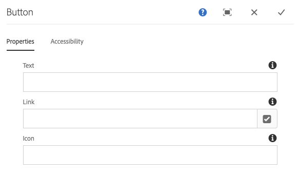

# 按鈕元件{#button-component}

核心元件按鈕元件可讓您在頁面上設定和顯示按鈕項目。

## 使用狀況 {#usage}

核心元件按鈕元件允許在頁面上包含按鈕。

* 可在「配置」對話框中選擇按鈕 [的屬性](#configure-dialog)。
* 可在設計對話框中定義「按鈕元件」 [的樣式](#design-dialog)。

## 版本與相容性 {#version-and-compatibility}

目前的Button元件版本為v1，此版本於2019年6月隨核心元件2.5.0版推出，並在本檔案中加以說明。

下表詳細說明所有支援的元件版本、與元件版本相容的AEM版本，以及舊版檔案的連結。

| 元件版本 | AEM 6.3 | AEM 6.4 | AEM 6.5 | AEM As a Cloud Service |
|--- |--- |--- |---|---|
| v1 | 相容 | 相容 | 相容 | 相容 |

如需核心元件版本與版本的詳細資訊，請參閱檔案核 [心元件版本](versions.md)。

## 元件輸出示例 {#sample-component-output}

若要體驗「按鈕元件」，並檢視其設定選項以及HTML和JSON輸出的範例，請造訪「元件 [庫」](https://adobe.com/go/aem_cmp_library_button)。

## 技術詳細資訊 {#technical-details}

有關Button Component的最新技術文 [件可在GitHub上找到](https://adobe.com/go/aem_cmp_tech_button_v1)。

有關開發核心元件的詳細資訊，請參閱核心元 [件開發人員檔案](developing.md)。

## 配置對話框 {#configure-dialog}

「設定」對話方塊可讓內容作者定義按鈕，以及按鈕的行為和顯示方式，讓頁面的訪客使用。

### 屬性標籤 {#properties-tab}

* **Text** —— 要顯示在按鈕上的文字
* **連結** -連結至AEM內的內容頁面、外部資源或錨點
   * 使用「選 **取對話方** 」來選擇AEM中的路徑。
* **Icon** —— 用於在按鈕中顯示表徵圖的標識符

### 「輔助工具」頁籤 {#accessibility-tab}

在「協 **助工具** 」標籤上，可為元件的  ARIA協助工具標籤設定值。

* **Label** —— 元件的ARIA label屬性的值

## 設計對話框 {#design-dialog}

### 樣式標籤 {#styles-tab}

影像元件支援AEM [Style系統](authoring.md#component-styling)。
