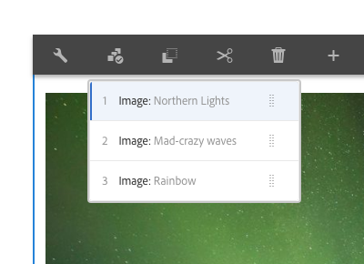

# 轉盤元件{#carousel-component}

核心元件轉盤元件可讓內容作者在導覽轉盤中呈現內容。

## 使用狀況 {#usage}

使用轉盤元件，內容作者可在投影片旋轉轉盤中組織內容。

[編輯對話方塊](#edit-dialog) 可讓內容作者建立、命名和排序多張投影片，並啓用延遲自動轉場。範本作者可以使用 [設計對話方塊](#design-dialog)，定義哪些元件可以加入轉盤、啓用或停用自動轉場，以及自訂樣式。

## 版本與相容性 {#version-and-compatibility}

目前版本的Carousel Component is v1，它是在2018年10月發行的版本2.2.0推出，並在本文中說明。

下表列出元件的所有支援版本、元件版本與元件相容的AEM版本，以及舊版文件的連結。

| 元件版本 | AEM6.3 | AEM6.4 | AEM6.5 |
|--- |--- |--- |--- |
| v1 | 相容相容性 | 相容相容性 | 相容相容性 |

如需核心元件版本和版本的詳細資訊，請參閱文件 [核心元件版本](versions.md)。

## 元件輸出範例 {#sample-component-output}

以下是取自 [「我們零售](https://helpx.adobe.com/experience-manager/6-5/sites/developing/using/we-retail.html)業」的範例。

### 螢幕擷圖 {#screenshot}

### 元件庫 {#component-library}

若要體驗轉盤元件，以及查看其組態選項以及HTML和JSON輸出的範例，請造訪 [元件庫](http://opensource.adobe.com/aem-core-wcm-components/library/carousel.html)。

### 技術細節 {#technical-details}

有關轉盤元件的 [最新技術文件，請參閱GitHub](https://github.com/adobe/aem-core-wcm-components/blob/master/content/src/content/jcr_root/apps/core/wcm/components/carousel/v1/carousel)。

有關開發核心元件的詳細資訊，請參閱 [核心元件開發人員文件](developing.md)。

## 編輯對話方塊 {#edit-dialog}

編輯對話方塊可讓內容作者新增、重新命名和重新排列投影片，以及定義自動轉場設定。

### 項目標籤 {#items-tab}

使用 **「新增** 」按鈕開啓元件選擇器，以選擇要新增為標籤的元件。新增後，清單會新增至清單中，其中包含下列欄：

* **圖示** -標籤的元件類型圖示，以方便清單中的識別。將滑鼠移至上方，將完整元件名稱視為工具提示。
* **描述** -作為標籤文字的說明，預設為標籤所選元件的名稱。
* **刪除** -點選或按一下，從標籤元件刪除標籤。
* **重新排序** -點選或點選並拖曳以訂購標籤。

### 屬性索引標籤 {#properties-tab}

在 **「屬性** 」索引標籤上，內容作者可以設定投影片自動轉換。

* **自動轉換投影片** -當作用中時，元件會自動前進至下一張投影片，然後再指定延遲。
* **轉換延遲** -當選取自動轉場投影片時，此值可用來定義轉場之間的延遲(以毫秒為單位)。
* **在滑鼠停留** 時停用自動暫停-當選取 **自動轉場投影片** 時，轉盤轉場會在游標停留在轉盤上時自動暫停。選取此選項，讓轉場不會暫停。

>[!NOTE]
>
>在 **編輯** 模式中，投影片進階控制項無法啓用。使用 [**「預覽** 」模式](https://helpx.adobe.com/experience-manager/6-5/sites/authoring/using/editing-content.html) 或 **[「檢視為已發佈」](https://helpx.adobe.com/experience-manager/6-5/sites/authoring/using/editing-content.html)** 選項，將轉盤與已發佈內容的讀者互動。
>
>**在編輯** 模式中，未啓用自動進階功能。使用 **[「檢視為已發佈](https://helpx.adobe.com/experience-manager/6-5/sites/authoring/using/editing-content.html)** 」選項，檢視已發佈內容的讀者將會看到的自動進階功能。

## 選取面板 {#select-panel}

內容作者可使用元件工具列上的 **「選取面板** 」選項，變更為不同的投影片以進行編輯，並輕鬆重新排列投影片順序。

在元件工具列中選取「 **選取面板** 」選項後，設定的投影片會顯示為下拉式清單。

* 清單是依投影片的指派排列排列，並反映在編號中。
* 投影片的元件類型會先顯示，後面接著投影片的說明。

* 點選或按一下下拉式清單中的項目，會將編輯器中的檢視切換為該投影片。
* 您可以使用拖曳控制點，就地排序投影片。

## 設計對話方塊 {#design-dialog}

此設計對話方塊可讓範本作者定義哪些元件可加入至轉盤元件，以及定義自動轉場預設值，以及內容作者可用的自訂樣式。

### 屬性索引標籤 {#properties-tab-1}

**「屬性** 」索引標籤可用來定義當內容作者新增轉盤元件至頁面時，投影片轉場的預設設定。

* **自動轉換投影片** -定義當內容作者將轉盤元件新增至頁面時，預設會啓用自動前進轉盤至下一張投影片的選項。
* **轉換延遲** -定義內容作者將轉盤元件加入頁面時，投影片之間轉場延遲的預設值(以毫秒為單位)。
* **在滑鼠停留** 時停用自動暫停-定義預設情況下，當內容作者選取 **自動轉場投影片** 時，會啓用自動投影片暫停選項。

### 允許的元件標籤 {#allowed-components-tab}

**「允許的元件** 」索引標籤用於定義內容作者可以新增哪些元件做為投影片至「轉盤元件」。

在「範本編輯器」 [中定義「配置容器」的原則和屬性時，「允許元件」索引標籤的功能與相同名稱的標籤相同。](https://helpx.adobe.com/experience-manager/6-5/sites/authoring/using/templates.html)

### 樣式標籤 {#styles-tab}

轉盤元件支援AEM [樣式系統](authoring.md#component-styling)。