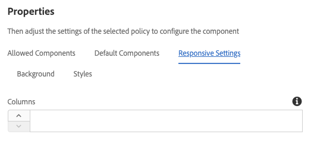

# Container Component{#container-component}

核心元件容器元件可讓您建立頁面上多個其他元件的容器。

## 使用狀況 {#usage}

核心元件容器元件可讓您針對頁面上的多個額外元件建立容器，並可用來分組其他元件並套用常見樣式或版面。

* The container&#39;s properties can be selected in the [configure dialog](#configure-dialog).
* Defaults for the Container Component when adding it to a page can be defined in the [design dialog](#design-dialog).

## Version and Compatibility {#version-and-compatibility}

目前版本的Container元件是v1，是在2019年月發行的版本2.5.0推出的v1，本文中說明。

下表列出元件的所有支援版本、元件版本與元件相容的AEM版本，以及舊版文件的連結。

| 元件版本 | AEM6.3 | AEM6.4 | AEM6.5 |
|--- |--- |--- |---|
| v1 | 相容相容性 | 相容相容性 | 相容相容性 |

For more information about Core Component versions and releases, see the document [Core Components Versions](versions.md).

## Sample Component Output {#sample-component-output}

To experience the Container Component as well as see examples of its configuration options as well as HTML and JSON output, visit the [Component Library](http://opensource.adobe.com/aem-core-wcm-components/library/container.html).

## Technical Details {#technical-details}

The latest technical documentation about the Container Component [can be found on GitHub](https://github.com/adobe/aem-core-wcm-components/tree/master/content/src/content/jcr_root/apps/core/wcm/components/container/v1/container).

Further details about developing Core Components can be found in the [Core Components developer documentation](developing.md).

## Configure Dialog {#configure-dialog}

設定對話方塊可讓內容作者定義容器項目，以及該物件對頁面的行為和顯示方式。

* **配置** -此選項定義容器元件的行為或版面行為。
   * **簡單** -將容器定義為簡單的元件集合
   * **回應式格線** -定義容器為 [AEM Responsive格線](https://helpx.adobe.com/experience-manager/6-5/sites/authoring/using/responsive-layout.html)
* **ID** -使用此選項可定義要套用至元件的HTML ID屬性。
* **背景色彩** -可定義為自由格式RGB值，或使用檢色器( [視組態而定)](#background-tab)
* **背景影象** -定義容器的背景顏色，視 [組態而定](#background-tab)

## Design Dialog {#design-dialog}

此設計對話方塊可讓範本作者定義使用Container元件的內容作者可用的選項。

### Allowed Components Tab {#allowed-components-tab}

**「允許的元件** 」索引標籤用於定義內容作者可以將哪些元件新增為容器元件。

The Allowed Components tab functions in the same way as the tab of the same name when [defining the policy and properties of a Layout Container in the Template Editor.](https://helpx.adobe.com/experience-manager/6-5/sites/authoring/using/templates.html)

### Default Components Tab {#default-components-tab}

The Default Components tab is used to define which component is added to the component when a particular asset type is dropped on the container, similar to [how default components are defined on the page template](https://helpx.adobe.com/experience-manager/6-5/sites/authoring/using/templates.html#EditingTemplatesTemplateAuthors).

### Responsive Settings Tab {#responsive-settings-tab}

* **欄** -定義產生容器格線中的欄數。

### Background Tab {#background-tab}

* **背景影像**
   * **啓用背景影象** -選取此選項可讓內容作者定義容器的背景影象。
* **背景色彩**
   * **啓用背景顏色** -選取此選項可讓內容作者定義容器的背景顏色。
   * **僅限色票** -選取此選項只允許內容作者從預先定義的色票中選取容器背景顏色。
      * Only available when **Enable background color** is selected
* **允許的色票** -定義預先定義的顏色，其中內容作者可選取容器背景顏色
   * Use the **Add** button to add a pre-defined color swatch. 新增後，清單會新增至清單中，其中包含下列欄：
   * **值** -透過RGB值手動定義顏色
      * 點選或按一下檢色器，可以調整個別RGB值或定義十六進位值，以更輕鬆地選取顏色。
   * **刪除** -點選或按一下以刪除色票。
   * **重新排列** -點選或按一下並拖曳以重新排列色票順序。

### Styles Tab {#styles-tab}

The Container Component supports the AEM [Style System](authoring.md#component-styling).
