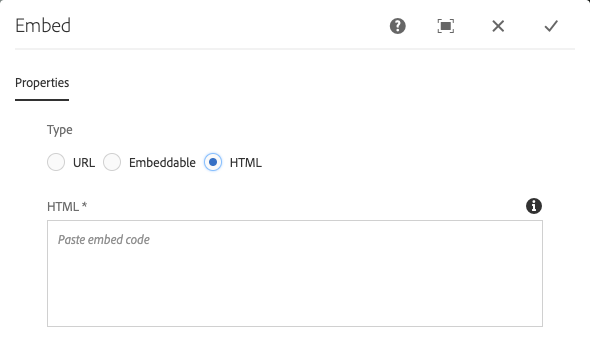

# 內嵌元件{#embed-component}

核心元件內嵌元件可讓您將外部內容內嵌至AEM內容頁面。

## 使用狀況 {#usage}

「核心元件內嵌元件」可讓內容作者定義要內嵌在AEM內容頁面中的選取外部內容。 此外，還有一個選項可定義要嵌入的自由格式HTML。

* 可在「配置」對話框中定義元件的 [屬性](#configure-dialog)。
* 將元件新增至頁面時的預設值，可在設計對話方塊中 [定義](#design-dialog)。

## 版本與相容性 {#version-and-compatibility}

目前的內嵌元件版本為v1，此版本於2019年9月隨核心元件2.7.0版推出，並在本檔案中加以說明。

下表詳細說明所有支援的元件版本、與元件版本相容的AEM版本，以及舊版檔案的連結。

| 元件版本 | AEM 6.3 | AEM 6.4 | AEM 6.5 |
|--- |--- |--- |---|
| v1 | 相容 | Compatible | Compatible |

如需核心元件版本與版本的詳細資訊，請參閱檔案核 [心元件版本](versions.md)。

## 元件輸出示例 {#sample-component-output}

若要體驗內嵌元件，並檢視其設定選項以及HTML和JSON輸出的範例，請造訪元 [件庫](http://opensource.adobe.com/aem-core-wcm-components/library/embed.html)。

## 技術詳細資訊 {#technical-details}

有關內嵌元件的最新技術文 [件可在GitHub上找到](https://github.com/adobe/aem-core-wcm-components/tree/master/content/src/content/jcr_root/apps/core/wcm/components/embed/v1/embed)。

Further details about developing Core Components can be found in the Core Components developer documentation.

## Configure Dialog {#configure-dialog}

The configure dialog allows the content author to define the external resource to be embedded on the page. First choose which type of resource should be embedded: **URL**, **Embeddable**, or **HTML**.

### URL {#url}

The simplest embed is the URL. 只需將您要內嵌的資源URL貼入「 **URL** 」欄位。 元件將嘗試訪問資源，如果某個處理器可以呈現資源，則會在 **URL欄位下顯示確認消息** 。 否則，欄位將會標籤為錯誤。

嵌入元件隨處理器提供以下資源類型：

* 符合「嵌入」標 [準的資源](https://oembed.com/) ，包括Facebook貼文、Instagram、SoundCloud、Twitter和YouTube
* Pinterest

開發人員可依照內嵌元件的 [開發人員檔案新增其他URL處理器。](https://github.com/adobe/aem-core-wcm-components/tree/master/content/src/content/jcr_root/apps/core/wcm/components/embed/v1/embed#extending-the-embed-component)

### 內嵌項目 {#embeddable}

嵌入式允許對嵌入式資源進行更多的定製，該嵌入式資源可以參數化並包括附加資訊。 An author is able to select from pre-configured trusted embeddables and the component ships with a Youtube embeddable out-of-the-box.

Embeddable **(可嵌入** )欄位定義要使用的處理器類型。 In the case of the YouTube embeddable you can then define:

* **視訊ID** —— 您要內嵌之資源的YouTube唯一視訊ID
* **Width - The width of the embedded video**
* **Height - The height of the embedded video**

Other embeddables would offer similar fields and can be defined by a developer by following the developer documentation of the Embed Component.

>[!NOTE]
>Embeddables must be enabled at the template level via the Design Dialog to be available to the page author.

### HTML {#html}

You can add free-form HTML to your page using the Embed Component.

>[!NOTE]
>任何不安全的標籤（例如指令碼）都會從輸入的HTML中篩選，而不會在產生的頁面上呈現。

## 設計對話框 {#design-dialog}

設計對話方塊可讓範本作者定義內容作者可用的選項，內容作者使用內嵌元件，並在放置內嵌元件時設定預設值。

* **Disable URL - Disables the URL option for the content author when selected******
* **禁用嵌入式** -在選中時禁用內 **容作者的「可嵌入** 」選項，而不管允許哪些可嵌入處理器。
* **停用HTML** —— 在選取時停 **用內容作者的HTML** 選項。
* **允許的嵌入** -定義內容作者可以使用哪些可嵌入處理器的多選項，但 **是Embeddable** 選項處於活動狀態。
