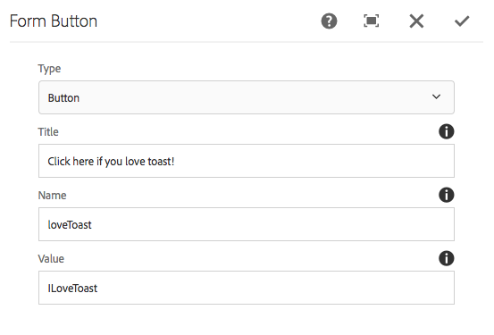

# Form Button Component (v1){#form-button-component-v}

核心元件表單按鈕元件允許在表單中包含按鈕欄位以觸發操作。

## 使用狀況 {#usage}

核心元件表單按鈕元件允許建立按鈕欄位，通常用來觸發表單的提交，並與表單容器元件一 [起使用](form-container.md)。

按鈕屬性可由內容編輯器在「設定」對話方塊中 [定義](form-button-v1.md#main-pars_title)。

## 版本與相容性 {#version-and-compatibility}

本檔案說明Form Button元件的v1，最初是隨AEM 6.3核心元件的1.0.0版一起推出。

下表列出表單按鈕元件v1的相容性。

| AEM版本 | 表單按鈕元件v1 |
|--- |--- |
| 6.3 | 相容 |
| 6.4 | 相容 |

>[!CAUTION]
>
>本檔案說明「表單按鈕元件」的v1。
>
>有關當前版本的「表單按鈕元件」的詳細資訊，請參閱「表 [單按鈕元件](form-button.md) 」文檔。

## 元件輸出示例 {#sample-component-output}

以下是 [We.Retail的範例](https://helpx.adobe.com/experience-manager/6-4/sites/developing/using/we-retail.html)。

### 螢幕擷圖 {#screenshot}


### HTML {#html}

```
<div class="cmp cmp-button aem-GridColumn aem-GridColumn--default--12">
    <div class="cmp cmp-button">
        <button type="BUTTON" class="btn btn-action btn-primary" name="loveToast" value="ILoveToast">
            Click here if you love toast!
        </button>
    </div>
</div>
```

### JSON {#json}

```
"container": {
              "columnClassNames": "aem-GridColumn aem-GridColumn--default--12",
              "columnCount": 12,
              "gridClassNames": "aem-Grid aem-Grid--12 aem-Grid--default--12",
              ":items": {
                "button": {
                  "columnClassNames": "aem-GridColumn aem-GridColumn--default--12",
                  ":type": "weretail/components/form/button",
                  "name": "loveToast",
                  "jcr:title": "Click here if you love toast!",
                  "type": "submit",
                  "value": "ILoveToast"
                }
              },
              ":itemsOrder": [
                "button"
              ],
              ":type": "weretail/components/form/container"
            }
```

>[!NOTE]
>
>從核心元件匯出JSON需要1.1.0版的核心元件。 如需詳細 [資訊，請參閱核心元件v1的相容性資訊](versions.md#main-pars_title_236368006) 。

## 配置對話框 {#configure-dialog}

配置對話框允許內容作者定義按鈕的參數。



* **類型**
   * **按鈕**
   * **提交**

* **Title** —— 按鈕上顯示的文字
   * 如果沒有提供，則預設為按鈕類型

* **Name - The name of the button, which is submitted with the form data**
* **值** -隨表單資料提交的按鈕值

## 設計對話框 {#design-dialog}

「表單按鈕」元件沒有設計對話方塊。

## 技術詳細資訊 {#technical-details}

有關「表單按鈕元件」的最新技 [術檔案，請參閱GitHub](https://github.com/adobe/aem-core-wcm-components/tree/master/content/src/content/jcr_root/apps/core/wcm/components/form/button/v1/button)。

您可從GitHub下載整個核心元件專案。

有關開發核心元件的詳細資訊，請參閱核心元 [件開發人員檔案](developing.md)。
