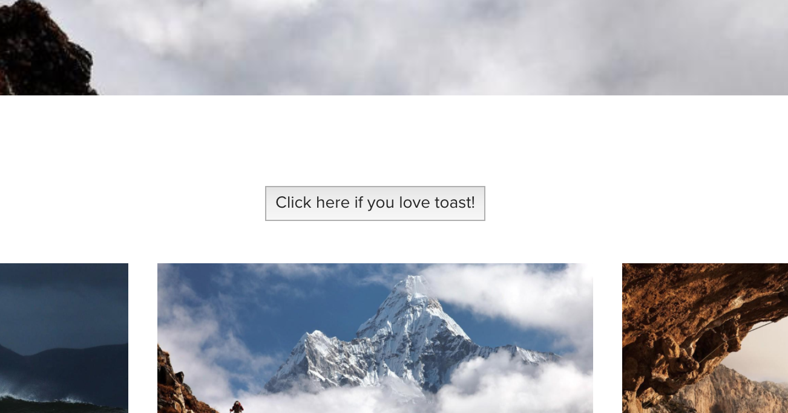
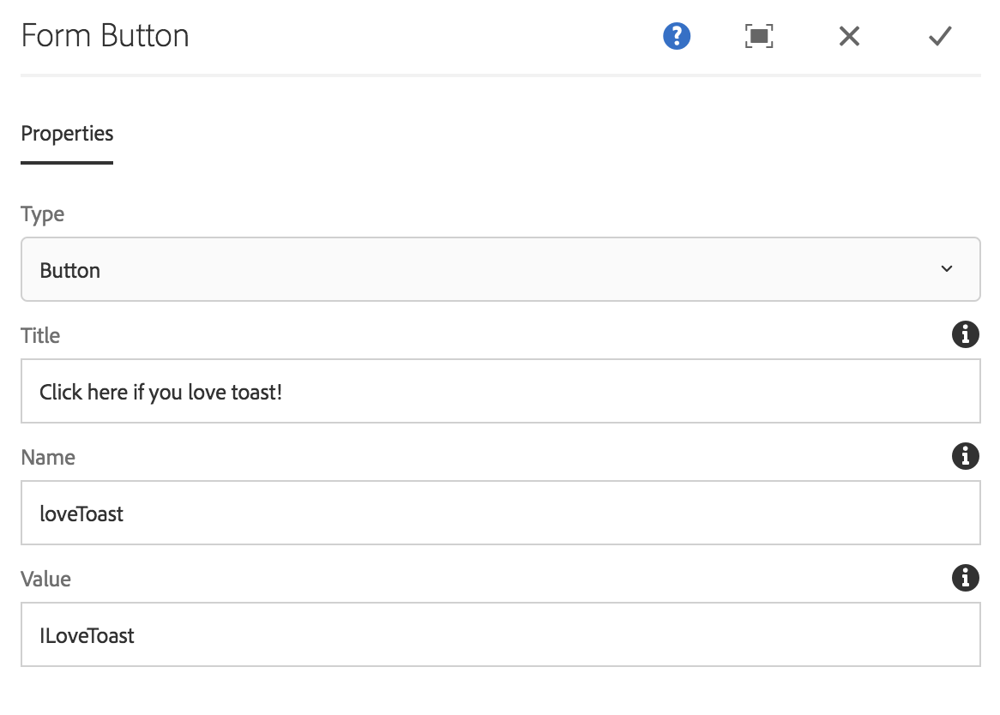

# 表單按鈕元件{#form-button-component}

核心元件表單按鈕元件允許包含按鈕以觸發頁面上的動作。

## 使用狀況 {#usage}

核心元件表單按鈕元件允許建立按鈕欄位，通常用來觸發表單的提交，並與表單容器元件一起 [使用](form-container.md)。

按鈕屬性可由內容編輯器在「設定」對話方塊中 [定義](form-button.md)。

## 版本與相容性 {#version-and-compatibility}

目前的表單按鈕元件版本為v2，此版本於2018年1月隨核心元件2.0.0版推出，並在本檔案中加以說明。

下表詳細說明所有支援的元件版本、與元件版本相容的AEM版本，以及舊版檔案的連結。

| 元件版本 | AEM 6.3 | AEM 6.4 | AEM 6.5 |
|--- |--- |--- |--- |
| v2 | 相容 | 相容 | 相容 |
| [v1](form-button-v1.md) | 相容 | 相容 | 相容 |

如需核心元件版本與版本的詳細資訊，請參閱檔案核 [心元件版本](versions.md)。

## 元件輸出示例 {#sample-component-output}

以下是 [We.Retail的範例](https://helpx.adobe.com/experience-manager/6-5/sites/developing/using/we-retail.html)。

### 螢幕擷圖 {#screenshot}



### HTML {#html}

```
<div class="container responsivegrid aem-GridColumn aem-GridColumn--default--12">
<form method="POST" action="/content/we-retail/us/en/experience.html" id="new_form" name="new_form" enctype="multipart/form-data" class="cmp-form aem-Grid aem-Grid--12 aem-Grid--default--12">
    <input type="hidden" name=":formstart" value="/content/we-retail/us/en/experience/jcr:content/root/responsivegrid/container">
    
    <div class="button aem-GridColumn aem-GridColumn--default--12">
<button type="BUTTON" class="cmp-form-button" name="loveToast" value="ILoveToast">Click here if you love toast!</button>
</div>

</form>
</div>
```

### JSON {#json}

```
"button":{  
                           "columnClassNames":"aem-GridColumn aem-GridColumn--default--12",
                           ":type":"core/wcm/sandbox/components/form/button/v2/button",
                           "name":"loveToast",
                           "jcr:title":"Click here if you love toast!",
                           "type":"button",
                           "value":"ILoveToast"
                        }
```

### 技術詳細資訊 {#technical-details}

有關「表單按鈕元件」的最新技 [術檔案，請參閱GitHub](https://github.com/adobe/aem-core-wcm-components/blob/master/content/src/content/jcr_root/apps/core/wcm/components/form/button/v2/button)。

有關開發核心元件的詳細資訊，請參閱核心元 [件開發人員檔案](developing.md)。

## 配置對話框 {#configure-dialog}

配置對話框允許內容作者定義按鈕的參數。

### 屬性標籤 {#properties-tab}



* **類型**

   * **按鈕**
   * **提交**

* **Title** —— 按鈕上顯示的文字

   * 如果沒有提供，則預設為按鈕類型

* **Name** —— 隨表單資料提交的按鈕名稱
* **值** -隨表單資料提交的按鈕值

## 設計對話框 {#design-dialog}

### 樣式標籤 {#styles-tab}

「表單按鈕」元件支援AEM [Style系統](authoring.md#component-styling)。