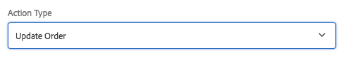

# 表單容器元件(v1){#form-container-component-v}

核心元件表單容器元件可讓您建立簡單的提交表單。

## 使用狀況 {#usage}

表單容器元件可支援簡單的WCM表單，並使用巢狀結構來允許其他表單元件，借此建立簡單的資訊提交表單和功能。

借由使用 [設定對話方塊](form-container-v1.md#main-pars_title) ，內容編輯器可以定義提交觸發程序的類型、送出的內容應儲存在何處，以及是否應觸發工作流程。範本作者可以使用 [設計對話方塊](form-container-v1.md#main-pars_title_1995166862) 來定義允許元件及其對應，類似範本編輯器中 [標準版面容器的設計對話方塊](https://helpx.adobe.com/experience-manager/6-4/sites/authoring/using/templates.html#main-pars_title_1754153843)。

## 版本與相容性 {#version-and-compatibility}

本文件說明表單容器元件的v1，原始版本為AEM6.3的1.0.0版核心元件。

下表列出表單容器元件的相容性。

| AEM版本 | 表單容器元件v1 |
|--- |--- |
| 6.3 | 相容相容性 |
| 6.4 | 相容相容性 |

>[!CAUTION]
>
>本文件說明表單容器元件的v1。
>
>如需目前版本容器元件的詳細資訊，請參閱 [表單容器元件](form-container.md) 文件。

## 設定對話方塊 {#settings-dialog}

設定對話方塊可讓內容作者定義元件提交時所採取的動作。

視選取 **的動作類型而定**，容器中可用的選項將會變更。可用的動作類型為：

* [郵件](form-container-v1.md#main-pars_title_966511656)
* [存放區內容](form-container-v1.md#main-pars_title_2065985840)
* [提交訂單](form-container-v1.md#main-pars_title_686874527)
* [更新訂單](form-container-v1.md#main-pars_title_410109286)

無論類型為何，都有 [一般設定](form-container-v1.md#main-pars_title_375403046) 適用於每個動作。

### 郵件 {#mail}

表單送出時，郵件動作類型會傳送電子郵件給指定的收件者。

* **主旨** -將於表單提交時傳送的電子郵件主旨
* **寄件者** ：將於表單提交時傳送的電子郵件地址
* **收件人** -收件者在表單提交時收到電子郵件的地址
   * 點選或按一下「 **新增** 」按鈕以新增其他位址
   * 點選或按一下「 **刪除** 」按鈕以移除電子郵件地址
* **CC** -收件者在表單提交時收到的電子郵件收件人地址
   * 點選或按一下「 **新增** 」按鈕以新增其他位址
   * 點選或按一下「 **刪除** 」按鈕以移除電子郵件地址

### 存放區內容 {#store-content}

表單提交時，表單內容會儲存在指定的存放庫位置。

* **內容路徑** -儲存提交內容的內容存放庫路徑
* **檢視資料** -點選或按一下，以JSON檢視儲存的提交資料
* **開始工作流程** -設定以在表單提交時以載入的內容啓動工作流程

### 提交訂單 {#submit-order}

表單提交時，將提交訂單。

### 更新訂單 {#update-order}

表單提交時，訂單將會更新。

### 一般設定 {#general-settings}

無論選取的動作類型為何，都能隨時定義感謝頁面。

表單提交完成後，使用者將會重新導向至指定的頁面。

* 使用「選擇對話方塊」在AEM中選取資源。
* 如果感謝頁面不在AEM中，請指定絕對URL。非絕對URL將會相對於AEM解讀。
* 保留空白即可在提交後重新顯示表格。

## 設計對話方塊 {#design-dialog}

設計對話方塊可讓範本作者定義允許的元件及其對應的對應，類似範本編輯器中 [標準版面配置容器的設計對話方塊](https://helpx.adobe.com/experience-manager/6-4/sites/authoring/using/templates.html#main-pars_title_1754153843)。

## 技術細節 {#technical-details}

有關表單容器元件的 [最新技術文件，請參閱GitHub](https://github.com/adobe/aem-core-wcm-components/tree/master/content/src/content/jcr_root/apps/core/wcm/components/form/container/v1/container)。

您可以從GitHub下載整個核心元件專案。

有關開發核心元件的詳細資訊，請參閱 [核心元件開發人員文件](developing.md)。
