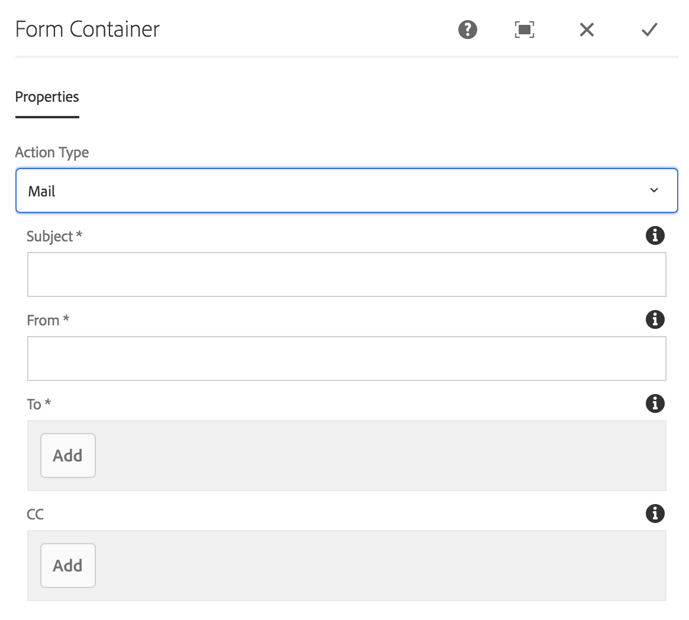

# 表單容器元件{#form-container-component}

核心元件表單容器元件可讓您建立簡單的提交表單。

## 使用狀況 {#usage}

表單容器元件可支援簡單的WCM表單並使用巢狀結構來建立簡單的資訊提交表單和功能，以允許其他表單元件。

透過使用 [設定對話方塊](#configure-dialog) ，內容編輯器可以定義表單提交觸發的動作、應儲存提交內容的位置，以及是否應觸發工作流程。範本作者可以使用 [設計對話方塊](#design-dialog) 來定義允許的元件及其對應，類似範本編輯器中 [標準版面容器的設計對話方塊](https://helpx.adobe.com/experience-manager/6-5/sites/authoring/using/templates.html)。

>[!NOTE]
>
>核心元件表單容器元件僅支援使用核心元件表單元件(按鈕、文字、隱藏等)。不支援核心元件表單容器中的 [基礎元件](https://helpx.adobe.com/experience-manager/6-5/sites/authoring/using/default-components-foundation.html) 表單元件(反之亦然)。

## 版本與相容性 {#version-and-compatibility}

目前版本的Form Container Component is v2，它是在2018年月發行的版本2.0.0推出，並在本文中說明。

下表列出元件的所有支援版本、元件版本與元件相容的AEM版本，以及舊版文件的連結。

| 元件版本 | AEM6.3 | AEM6.4 | AEM6.5 |
|--- |--- |--- |--- |
| v2 | 相容相容性 | 相容相容性 | 相容相容性 |
| [v1](form-container-v1.md) | 相容相容性 | 相容相容性 | 相容相容性 |

如需核心元件版本和版本的詳細資訊，請參閱文件 [核心元件版本](versions.md)。

## 技術細節 {#technical-details}

有關表單容器元件的 [最新技術文件，請參閱GitHub](https://github.com/adobe/aem-core-wcm-components/blob/master/content/src/content/jcr_root/apps/core/wcm/components/form/container/v2/container)。

有關開發核心元件的詳細資訊，請參閱 [核心元件開發人員文件](developing.md)。

## 設定對話方塊 {#configure-dialog}

設定對話方塊可讓內容作者定義元件提交時所採取的動作。

視選取 **的動作類型而定**，容器中可用的選項將會變更。可用的動作類型為：

* [郵件](#mail)
* [存放區內容](#store-content)
* [提交訂單](#submit-order)
* [更新訂單](#update-order)

無論類型為何，都有 [一般設定](#general-settings) 適用於每個動作。

### 郵件 {#mail}

表單送出時，郵件動作類型會傳送電子郵件給指定的收件者。

* **主旨**：將於表單提交時傳送的電子郵件主旨
* **從**電子郵件地址，電子郵件地址將於表單提交時傳送
* **收**件者在表單提交時收到電子郵件的地址

   * 點選或按一下「 **新增** 」按鈕以新增其他位址
   * 點選或按一下「 **刪除** 」按鈕以移除電子郵件地址
* **CC收**件者在表單提交時收到電子郵件的收件者地址
   * 點選或按一下「 **新增** 」按鈕以新增其他位址
   * 點選或按一下「 **刪除** 」按鈕以移除電子郵件地址

### 存放區內容 {#store-content}

表單提交時，表單內容會儲存在指定的存放庫位置。

* **儲存提交內容的內容路徑**內容存放庫路徑
* **檢視資料**點選或按一下，以JSON檢視儲存的提交資料
* **開始工作流程**設定，在表單提交時以載入的內容啓動工作流程

### 提交訂單 {#submit-order}

表單提交時，將提交訂單。

### 更新訂單 {#update-order}

表單提交時，訂單將會更新。

### 一般設定 {#general-settings}

無論選取的動作類型為何，都能隨時定義感謝頁面。

表單提交完成後，使用者將會重新導向至指定的頁面。

* 使用「選擇對話方塊」在AEM中選取資源。
* 如果感謝頁面不在AEM中，請指定絕對URL。非絕對URL將會相對於AEM解讀。
* 保留空白即可在提交後重新顯示表格。

## 設計對話方塊 {#design-dialog}

設計對話方塊可讓範本作者定義允許的元件及其對應的對應，類似範本編輯器中 [標準版面配置容器的設計對話方塊](https://helpx.adobe.com/experience-manager/6-5/sites/authoring/using/templates.html)。