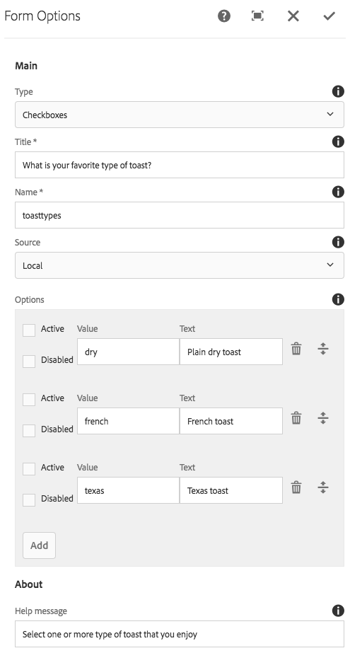

# 表單選項元件(v1){#form-options-component-v}

核心元件表單選項元件可讓您從預先定義的選項中選擇各種格式。

## 使用狀況 {#usage}

核心元件表單選項元件允許提交不同類型的選項，以搭配 [表單容器元件使用](form-container.md)。

選項、標籤和個別選項的呈現方式可由 [設定對話方塊](form-options-v1.md#main-pars_title)中的內容編輯器定義。

## 版本與相容性 {#version-and-compatibility}

本文件說明表單選項元件的v1，原始版本為AEM6.3的1.0.0版核心元件。

下表列出表單選項元件的相容性。

| 元件版本 | AEM6.3 | AEM6.4 |
|--- |--- |--- |
| v2 | 相容相容性 | 相容相容性 |
| v1 | 相容相容性 | 相容相容性 |

>[!CAUTION]
>
>本文件說明表單選項元件的v1。
>
>如需目前版本「表單選項元件」的詳細資訊，請參閱 [「表單選項元件](form-options.md) 」文件。

## 元件輸出範例 {#sample-component-output}

以下是取自 [「我們零售](https://helpx.adobe.com/experience-manager/6-4/sites/developing/using/we-retail.html)業」的範例。

### 螢幕擷圖 {#screenshot}


### HTML {#html}

```
<div class="cmp cmp-form aem-GridColumn aem-GridColumn--default--12">
<form method="POST" action="/content/we-retail/us/en/experience.html" id="new_form" name="new_form" enctype="multipart/form-data" class="aem-Grid aem-Grid--12 aem-Grid--default--12 ">
    <input type="hidden" name=":formstart" value="/content/we-retail/us/en/experience/jcr:content/root/responsivegrid/container">
    
    <div class="cmp cmp-options aem-GridColumn aem-GridColumn--default--12">

    <fieldset class="form-group checkbox">
        <legend>What is your favorite type of toast?</legend>
        
        <div class="checkbox-item">
            <label>
              <input type="checkbox" name="toasttypes" value="dry">
              Plain dry toast
            </label>
        </div>
<div class="checkbox-item">
            <label>
              <input type="checkbox" name="toasttypes" value="french">
              French toast
            </label>
        </div>
<div class="checkbox-item">
            <label>
              <input type="checkbox" name="toasttypes" value="texas">
              Texas toast
            </label>
        </div>

    </fieldset>
    
</div>
    
</form></div>
```

### JSON {#json}

```
"container": {
              "columnClassNames": "aem-GridColumn aem-GridColumn--default--12",
              "columnCount": 12,
              "gridClassNames": "aem-Grid aem-Grid--12 aem-Grid--default--12",
              ":items": {
                "options": {
                  "columnClassNames": "aem-GridColumn aem-GridColumn--default--12",
                  ":type": "weretail/components/form/options",
                  "name": "toastTypes",
                  "jcr:title": "What is your favorite type of toast?",
                  "source": "local",
                  "type": "checkbox"
                }
              },
              ":itemsOrder": [
                "options"
              ],
              ":type": "weretail/components/form/container"
            }
```

>[!NOTE]
>
>從核心元件匯出JSON需要1.1.0版核心元件。如需詳細資訊，請參閱核心元件v [](versions.md#main-pars_title_236368006) 的相容性資訊。

## 設定對話方塊 {#configure-dialog}

設定對話方塊可讓內容作者定義應該顯示的選項類型、標籤以及可用選項。



* **輸入**選項的顯示方式

   * **核取方塊**
   * **選項按鈕**
   * **下拉式清單**
   * **複選下拉式清單**

* **標題** -將顯示為選項標籤的標題
* **名稱** -表單資料所提交欄位的名稱
* **來源** -定義選項的位置

   * **本機** -定義於元件內
      * 點選或按一下「 **新增** 」按鈕可新增值， **刪除** 以移除值
      * **值** -當表單提交時選取該選項時所儲存的值
      * **文字** -表格上顯示選項的標籤
      * **活動-** 當表單載入時，選項會標示為已選取
      * **已停用** -無法選取選項，但仍顯示
      * **清單** -在AEM其他位置定義的靜態清單用於選項
         * **清單** - AEM中靜態清單的路徑
            * 使用「瀏覽」按鈕尋找清單資源
      * **資料來源** -資料來源用於選項
         * **資料來源** -資料來源的資源類型
* **說明訊息** -使用者可在欄位中輸入的提示訊息

## 設計對話方塊 {#design-dialog}

「表單選項」元件沒有設計對話方塊。

## 技術細節 {#technical-details}

有關表單選項元件的 [最新技術文件，請參閱GitHub](https://github.com/adobe/aem-core-wcm-components/tree/master/content/src/content/jcr_root/apps/core/wcm/components/form/options/v1/options)。

您可以從GitHub下載整個核心元件專案。

有關開發核心元件的詳細資訊，請參閱 [核心元件開發人員文件](developing.md)。
