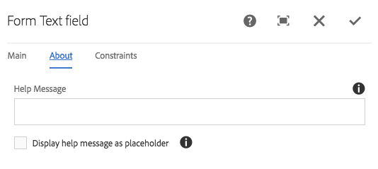

# 表單文字元件{#form-text-component}

核心元件表單文字元件允許輸入表單文字以供提交。

## 使用狀況 {#usage}

「表單文字」元件允許提交不同類型的文字，並可與表單容器元件一 [起使用](form-container.md)。 文字驗證、標籤和說明訊息的類型可由內容編輯器在「設定」對話方塊中 [定義](#configure-dialog)。

## 版本與相容性 {#version-and-compatibility}

目前的表單文字元件版本為v2，此版本於2018年1月隨核心元件2.0.0版推出，並在本檔案中加以說明。

下表詳細說明所有支援的元件版本、與元件版本相容的AEM版本，以及舊版檔案的連結。

| 元件版本 | AEM 6.3 | AEM 6.4 | AEM 6.5 | AEM As a Cloud Service |
|--- |--- |--- |--- |---|
| v2 | 相容 | 相容 | 相容 | 相容 |
| [v1](form-text-v1.md) | 相容 | 相容 | 相容 | - |

如需核心元件版本與版本的詳細資訊，請參閱檔案核 [心元件版本](versions.md)。

## 元件輸出示例 {#sample-component-output}

以下是 [We.Retail的範例](https://docs.adobe.com/content/help/en/experience-manager-65/developing/bestpractices/we-retail/we-retail.html)。

### 螢幕擷圖 {#screenshot}


### HTML {#html}

```
<div class="text aem-GridColumn aem-GridColumn--default--12">
   <div class="cmp-form-text">
      <label for="form-text-2146967">How many pieces of toast would you like?
      </label>
   <input class="cmp-form-text__text" type="number" id="form-text-2146967" name="pieces">
   </div>
</div>
```

### JSON {#json}

```
"text":{  
                     "columnClassNames":"aem-GridColumn aem-GridColumn--default--12",
                     "id":"form-text-2146967",
                     "title":"How many pieces of toast would you like?",
                     "name":"pieces",
                     "value":"",
                     "helpMessage":"",
                     "type":"number",
                     "readOnly":false,
                     "required":false,
                     "requiredMessage":"",
                     "constraintMessage":"",
                     "rows":2,
                     "defaultValue":"",
                     ":type":"core/wcm/components/form/text/v2/text"
                  }
```

### 技術詳細資訊 {#technical-details}

有關表單文字元件的最新技術 [檔案可在GitHub上找到](https://adobe.com/go/aem_cmp_tech_form_text_v2)。

有關開發核心元件的詳細資訊，請參閱核心元 [件開發人員檔案](developing.md)。

## 配置對話框 {#configure-dialog}

配置對話框允許內容作者定義要輸入的文本類型以及預設值和標籤。

### 主頁籤 {#main-tab}


* **Constraint**&#x200B;要輸入並將驗證的文本類型
   * **文字**
   * **文字區域**
   * **電子郵件**
   * **電話**
   * **日期**
   * **數字**
   * **密碼**
* **文本行**&#x200B;要在文本區域中顯示的行數(僅當「約束」( **Constraint** )設定為「文本區域」( **Text Area**)時顯示)
* **Label**&#x200B;為欄位顯示的標籤
* **如果標籤僅用於輔助功能**，且不提供任何關於該欄位的其他視覺資訊，則隱藏標籤不顯示「需要」
* **元素名**&#x200B;稱隨表單資料提交的欄位名稱
* **值**&#x200B;在欄位中預先填入的預設值

### 關於標籤 {#about-tab}



* **幫助消**&#x200B;息向用戶提示可在欄位中輸入的內容
* **將說明訊息顯示為預留位置**：若要在表單輸入內顯示說明訊息，請在其空白且未聚焦時顯示

### 約束頁籤 {#constraints-tab}


* **限制訊息**
   * 如果值沒有驗證選取的類型，提交表單時訊息會顯示為工具提示
   * 不顯示文本 **和文本** 區 **域約束類型**
* **必要**：如果選取此選項，使用者必須先填入值，才能提交表格
* **設為唯讀**：如果選取此選項，使用者無法修改欄位的值

## 設計對話框 {#design-dialog}

「表單文字」元件沒有設計對話方塊。
