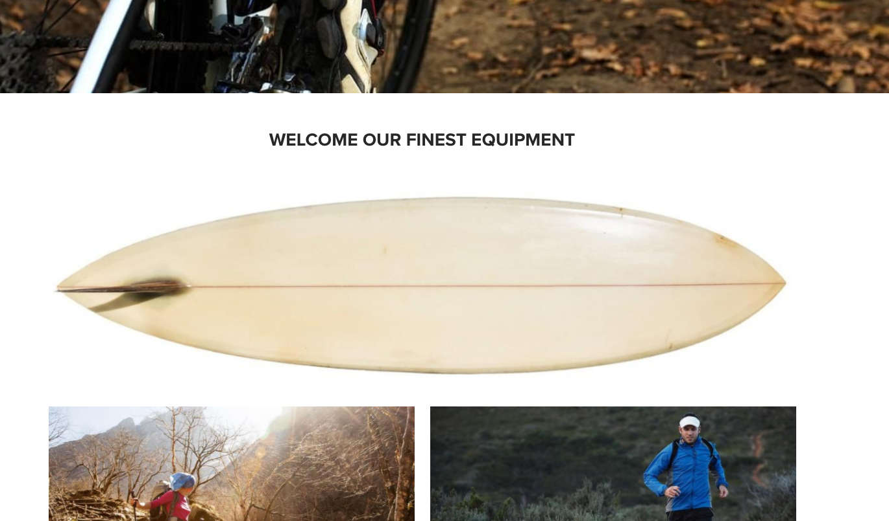

# 影像元件(v1){#image-component-v}

核心元件影像元件是可調式影像元件功能，可進行就地編輯。

## 使用狀況 {#usage}

Image Component可讓您輕鬆放置影像資產並提供就地編輯。它具備漸進式影像選擇功能，以及內容製作的延遲載入功能。

您可以在 [設計對話方塊中，由範本作者定義允許的影像寬度以及裁切和其他設定](image-v1.md#main-pars_title_1995166862)。內容編輯器可以在 [設定對話方塊](image-v1.md#main-pars_title_55926120) 中上傳或選取資產，並在 [編輯對話方塊中裁切影像](image-v1.md#main-pars_title)。為方便您加入，也提供簡單易用的影像就地修改功能。

## 版本與相容性 {#version-and-compatibility}

本文件說明Image Component v1of the Image Component，最初隨附於AEM6.3的核心元件1.0.0版。

下表列出影像元件v的相容性。

| AEM版本 | 影像元件v1 |
|--- |--- |
| 6.3 | 相容相容性 |
| 6.4 | 相容相容性 |

>[!CAUTION]
>
>本文件說明影像元件的v1。
>
>如需目前版本影像元件的詳細資訊，請參閱 [影像元件](image.md) 文件。

## 元件輸出範例 {#sample-component-output}

以下是取自 [「我們零售](https://helpx.adobe.com/experience-manager/6-4/sites/developing/using/we-retail.html)業」的範例。

### 螢幕擷圖 {#screenshot}



### HTML {#html}

```
<div class="cmp cmp-image aem-GridColumn aem-GridColumn--default--12">
 
        <noscript data-cmp-image="{&#34;smartImages&#34;:[],&#34;smartSizes&#34;:[],&#34;lazyEnabled&#34;:true}">
            
        </noscript>

</div>
```

### JSON {#json}

```
"image": {
              "columnClassNames": "aem-GridColumn aem-GridColumn--default--12",
              "smartSizes": [],
              "smartImages": [],
              "lazyEnabled": true,
              "src": "/content/we-retail/us/en/equipment/equipment/jcr%3acontent/root/responsivegrid/image.img.jpeg",
              ":type": "weretail/components/content/image"
            }
```

>[!NOTE]
>
>從核心元件匯出JSON需要1.1.0版核心元件。如需詳細資訊，請參閱核心元件v [](versions.md#main-pars_title_236368006) 的相容性資訊。

## 設定對話方塊 {#configure-dialog}

除了標準 [編輯對話方塊](image-v1.md#main-pars_title) 和 [設計對話方塊](image-v1.md#main-pars_title_1995166862)外，影像元件還提供設定對話方塊的對話方塊，其中定義影象本身及其說明和基本屬性。


* **影像資產**
   * 從 [資產瀏覽器拖曳資產，](https://helpx.adobe.com/experience-manager/6-3/sites/authoring/using/author-environment-tools.html#main-pars_title) 或點選 **瀏覽** 選項以從本機檔案系統上傳。
   * 點選或按一下 **清除** ，以取消選取目前選取的影像。
   * 點選或按一下 **「編輯** 」，在資產編輯器中 [插入資產](https://helpx.adobe.com/experience-manager/6-3/assets/using/managing-assets-touch-ui.html#main-pars_title_19) 的轉譯。

* **影像是裝飾性** -檢查影像是否應被輔助技術忽略，因此不需要替代文字。這僅適用於裝飾影像。
* **替代文字** -影像的意義或函數替代文字，適用於視覺效果不穩定的讀者。
* **連結**
   * 將影像連結到另一個資源。
   * 使用選取對話方塊連結至其他AEM資源。
   * 如果未連結到AEM資源，請輸入絕對URL。非解決方案URL將被解讀為相對於AEM。

* **註解** -影像的其他資訊，顯示在影像下方。
* **顯示標題做為快顯** 視窗-勾選的標題不會顯示在影像下方，但會在某些瀏覽器停留在影像上時顯示為快顯視窗。

## 編輯對話方塊 {#edit-dialog}

編輯對話方塊可讓內容作者裁切、修改啓動地圖並縮放影象。


* 開始裁切

   

   選取此選項會開啓預先定義裁切比例的下拉式清單。

   * 選擇「Free Hand」( **免費手** )選項，以定義自己的裁切。
   * 選擇 **「移除裁切」** 選項，以顯示原始資產。
   選取裁切選項後，請使用藍色控點來調整影像的裁切大小。

   

* 向右旋轉

   

   使用此選項可將影像旋轉至右側(順時針)。

* 啓動地圖

   

   使用此選項可套用啓動地圖至影像。選取此選項會開啓新視窗，讓使用者選取地圖的形狀：

   * **新增矩形地圖**
   * **新增圓形圖**
   * **新增多邊形地圖**

      * 預設會新增三角形地圖。連按兩下形狀線條，新增新邊的藍色大小控制點。
   選取地圖形狀後，就會疊加在影像上，以便調整大小。拖放藍色大小控點以調整形狀。

   

   調整啓動地圖的大小後，按一下它以開啓浮動工具列，以定義連結路徑。

   * **路徑**
      * 使用路徑選擇器選項在AEM中選取路徑
      * 如果路徑不在AEM中，請使用絕對URL。非絕對路徑將與AEM相關。

      * **Alt文字**替代說明路徑目的地
      * **目標**
         * **相同標籤**
         * **新標籤**
         * **父框架**
         * **上框架**
   點選或按一下藍色勾號以儲存、要取消的黑色x，以及紅色垃圾桶可以刪除地圖。

   

* 重設縮放

   

   如果影像已經縮放，請使用此選項重設縮放等級。

* 開啓縮放滑桿

   

   使用此選項可顯示滑桿，以控制影像縮放等級。

   

就地編輯器也可以用來修改影像。由於空間限制，僅提供基本選項。若需完整編輯選項，請使用全螢幕模式。


>[!NOTE]
>
>GIF影像不支援影像編輯作業(裁切、翻轉、旋轉)。在編輯模式中對GIF進行的任何這類變更都不會持續存在。

## 設計對話方塊 {#design-dialog}

此設計對話方塊可讓範本作者定義使用此元件時，內容作者的裁切、上傳和旋轉上傳。

### 主要功能 {#main}

在 **主** 標籤上，您可以定義影像允許的像素寬度清單，以自動從清單中載入最適當的寬度。


點選或按一下「新增」按鈕以新增另一個大小。

* 使用抓取控點重新排列大小順序。
* 使用刪除圖示移除寬度。

依預設會延遲影像載入，直到顯示出來為止。選取「 **停用延遲載入** 」選項，以載入頁面時載入影像。

### 功能 {#features}

在 **「功能** 」索引標籤上，您可以定義內容作者在使用元件時可用的選項，包括上傳選項、方向和裁切選項。

* 來源

   

   選取 **允許從檔案系統** 上傳資產的選項，允許內容作者從本機電腦上傳影像。若要強制內容作者只選取AEM的資產，請取消選取此選項。

* 方向

   

   * **旋轉-** 使用此選項可讓內容作者使用 **「旋轉正確」** 選項。
   * **Flip**使用此選項可讓內容作者使用 **「水平翻轉** 」和 **「翻轉垂直** 」選項。
   >[!CAUTION]
   >
   >預設會停用 **「翻轉」** 選項。啓用它會在影像元件的編輯對話方塊中顯示 **「翻轉垂直** 」和 **「翻轉」** 按鈕，但是AEM目前不支援此功能，而使用這些選項所做的任何變更都不會持續存在。

<!-- 
Comment Type: remark
Last Modified By: Chris Bohnert (bohnert)
Last Modified Date: 2017-11-20T05:51:34.378-0500

<p>Added caution based on CQDOC-11457. Hid the flip options in the procedure using the <strong>Draft</strong> option so that when this feature is implemented in CQ-4221539, the <strong>Draft</strong> property can simply be removed along with the caution.</p>
-->

* 裁切

   

   選取 **「允許裁切** 」選項，允許內容作者在編輯對話方塊中裁切元件中的影像。
   * 按一下 **「新增** 」，新增預先定義的裁切外觀比例。
   * 輸入描述性名稱，此名稱將顯示在 **「開始裁切」** 下拉式清單中。
   * 輸入外觀的數值比例。
   * 使用拖曳控點重新排列外觀比例的順序
   * 使用垃圾筒圖示可刪除外觀比例。
   >[!CAUTION]
   >
   >請注意，在AEM中，裁切外觀比例定義為 **高度/寬度**。這與傳統的寬度/高度定義不同，而且會基於舊有相容性原因而執行。只要您在UI中顯示名稱，而非比例本身，內容作者就不會察覺任何差異。

## 技術細節 {#technical-details}

有關Image Component [的最新技術文件，請參閱GitHub](https://github.com/adobe/aem-core-wcm-components/tree/master/content/src/content/jcr_root/apps/core/wcm/components/image/v1/image)。

您可以從GitHub下載整個核心元件專案。

有關開發核心元件的詳細資訊，請參閱 [核心元件開發人員文件](developing.md)。
