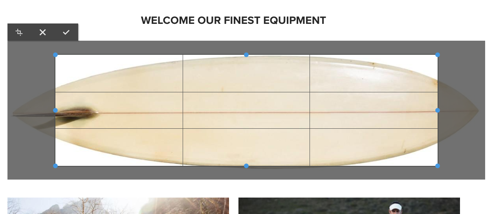
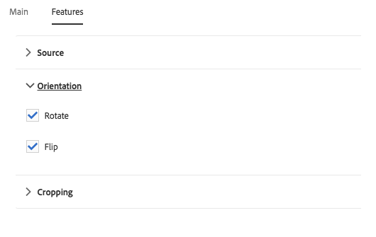
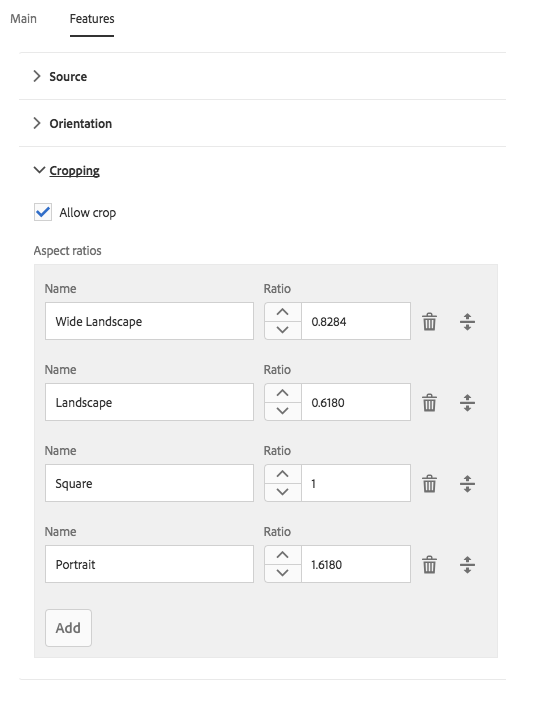

# 影像元件{#image-component}

核心元件影像元件是一種調適性影像元件，可用來進行就地編輯。

## 使用狀況 {#usage}

Image Component可讓您輕鬆放置影像資產並提供就地編輯。它具備漸進式影像選擇功能，以及內容製作的延遲載入功能。

The image widths as well as cropping and additional settings can be defined by the template author in the [design dialog](#design-dialog). The content editor can upload or select assets in the [configure dialog](#configure-dialog) and crop the image in the [edit dialog](#edit-dialog). 為方便您加入，也提供簡單易用的影像就地修改功能。

## Version and Compatibility {#version-and-compatibility}

目前的Image Component版本是v2，是在2018年月發行的版本2.0.0推出，並在本文中說明。

下表列出元件的所有支援版本、元件版本與元件相容的AEM版本，以及舊版文件的連結。

| 元件版本 | AEM6.3 | AEM6.4 | AEM6.5 |
|--- |--- |--- |--- |
| v2 | 相容相容性 | 相容相容性 | 相容相容性 |
| [v1](image-v1.md) | 相容相容性 | 相容相容性 | 相容相容性 |

For more information about Core Component versions and releases, see the document [Core Components Versions](versions.md).

## SVG Support {#svg-support}

影像元件支援可縮放向量圖形(SVG)。

* 同時支援從DAM拖放SVG資產，以及從本機檔案系統上傳SVG檔案。
* 最適化影像Servlet串流原始SVG檔案(跳過變形)。
* 對於SVG影像，「智慧型影像」和「智慧大小」會設為影像模型中的空白陣列。

### Security {#security}

基於安全理由，影像編輯器絕不會直接呼叫原始SVG。It is called through ``. 因此，瀏覽器會防止內嵌於SVG檔案中的指令碼執行。

>[!CAUTION]
>
>SVG support requires release 2.1.0 of the Core Components or higher along with [service pack 2](https://helpx.adobe.com/experience-manager/6-4/release-notes/sp-release-notes.html) for AEM 6.4 or [service pack 3](https://helpx.adobe.com/experience-manager/6-3/release-notes/sp3-release-notes.html) for AEM 6.3 or higher to support [new image editor features](https://helpx.adobe.com/experience-manager/6-4/sites/developing/using/image-editor.html) within AEM.

## Sample Component Output {#sample-component-output}

To experience the Image Component as well as see examples of its configuration options as well as HTML and JSON output, visit the [Component Library](http://opensource.adobe.com/aem-core-wcm-components/library/image.html).

### Technical Details {#technical-details}

The latest technical documentation about the Image Component [can be found on GitHub](https://github.com/adobe/aem-core-wcm-components/blob/master/content/src/content/jcr_root/apps/core/wcm/components/image/v2/image).

Further details about developing Core Components can be found in the [Core Components developer documentation](developing.md).

>[!NOTE]
>
>As of Core Components release 2.1.0, the Image Component supports [schema.org microdata](https://schema.org).

## Configure Dialog {#configure-dialog}

In addition to the standard [edit dialog](#edit-dialog) and [design dialog](#design-dialog), the image component offers a configure dialog where the image itself is defined along with its description and basic properties.

### Asset Tab {#asset-tab}

* **影像資產**
   * Drop an asset from the [asset browser](https://helpx.adobe.com/experience-manager/6-5/sites/authoring/using/author-environment-tools.html) or tap the **browse** option to upload from a local file system.
   * Tap or click **Clear** to de-select the currently selected image.
   * Tap or click **Edit** to [mange the renditions of the asset](https://helpx.adobe.com/experience-manager/6-5/assets/using/managing-assets-touch-ui.html) in the asset editor.

### Metadata Tab {#metadata-tab}

* **影像為裝飾性** 檢查影像是否應由輔助技術忽略，因此不需要替代文字。這僅適用於裝飾影像。
* **替代文字** 替代影像的意義或函數替代文字，適用於視覺效果不穩定的讀者。
   * Get alternative text from DAM - When checked the image&#39;s alternative text will be populated with the value of the `dc:description` metadata in DAM.

* **標題** 其他關於影像的資訊，依預設會顯示在影像下方。
   * **從DAM** 取得標題時，影像的標題文字會填入DAM `dc:title` 中中繼資料的值。
   * **顯示標題為** 快顯視窗時，標題不會顯示在影像下方，但會在某些瀏覽器停留在影像上時顯示為快顯視窗。

* **連結**
   * 將影像連結到另一個資源。
   * 使用選取對話方塊連結至其他AEM資源。
   * 如果未連結到AEM資源，請輸入絕對URL。非解決方案URL將被解讀為相對於AEM。

## Edit Dialog {#edit-dialog}

編輯對話方塊可讓內容作者裁切、修改啓動地圖並縮放影象。

* 開始裁切

   

   選取此選項會開啓預先定義裁切比例的下拉式清單。

   * Choose the option **Free Hand** to define your own crop.
   * Choose the option **Remove Crop** to display the original asset.
   選取裁切選項後，請使用藍色控點來調整影像的裁切大小。

   

* 向右旋轉

   

   使用此選項可將影像旋轉至右側(順時針)。

* 水平翻轉

   

   使用此選項可水平翻轉影像，或沿著y軸旋轉影像180°。

* 垂直翻轉

   

   使用此選項可垂直翻轉影像，或沿著x軸旋轉影像180°。

* 啓動地圖

   >[!CAUTION]
   >
   >The Launch Map feature requires release 2.1.0 of the Core Components or higher along with [service pack 2](https://helpx.adobe.com/experience-manager/6-4/release-notes/sp-release-notes.html) for AEM 6.4 or [service pack 3](https://helpx.adobe.com/experience-manager/6-3/release-notes/sp3-release-notes.html) for AEM 6.3 or higher to support [new image editor features](https://helpx.adobe.com/experience-manager/6-4/sites/developing/using/image-editor.html) within AEM.

   

   使用此選項可套用啓動地圖至影像。選取此選項會開啓新視窗，讓使用者選取地圖的形狀：

   * **新增矩形地圖**
   * **新增圓形圖**
   * **新增多邊形地圖**
      * 預設會新增三角形地圖。連按兩下形狀線條，新增新邊的藍色大小控制點。
   選取地圖形狀後，就會疊加在影像上，以便調整大小。拖放藍色大小控點以調整形狀。

   

   調整啓動地圖的大小後，按一下它以開啓浮動工具列，以定義連結路徑。

   * **路徑**
      * 使用路徑選擇器選項在AEM中選取路徑
      * 如果路徑不在AEM中，請使用絕對URL。非絕對路徑將與AEM相關。
   * **Alt文字** 替代說明路徑目的地
   * **目標**
      * **相同標籤**
      * **新標籤**
      * **父框架**
      * **上框架**
   點選或按一下藍色勾號以儲存、要取消的黑色x，以及紅色垃圾桶可以刪除地圖。

   

* 重設縮放

   

   如果影像已經縮放，請使用此選項重設縮放等級。

* 開啓縮放滑桿

   

   使用此選項可顯示滑桿，以控制影像縮放等級。

   

就地編輯器也可以用來修改影像。由於空間限制，僅提供基本選項。若需完整編輯選項，請使用全螢幕模式。

>[!NOTE]
>
>GIF影像不支援影像編輯作業(裁切、翻轉、旋轉)。在編輯模式中對GIF進行的任何這類變更都不會持續存在。

## Design Dialog {#design-dialog}

此設計對話方塊可讓範本作者定義當使用此元件時，內容作者所擁有的裁切、上傳和旋轉以及上傳選項。

### Main Tab {#main-tab}

**在主** 標籤上，您可以定義影像的像素寬度清單，以自動從清單中載入最適當的寬度。

此外，您也可以定義當作者新增元件至頁面時，會自動或停用哪些一般元件選項。

* **啓用延遲載入**：在新增影像元件至頁面時，自動啓用延遲載入選項。
* **影像為裝飾性** 定義：在新增影像元件至頁面時，會自動啓用裝飾影像選項。
* **從DAM取得替代文字**，如果在新增影像元件至頁面時，自動啓用從DAM擷取替代文字的選項。
* **取得DAM** 定義的標題：在新增影像元件至頁面時，自動啓用從DAM擷取標題的選項。
* **顯示標題做為彈出式** 定義，如果將影像元件新增至頁面時，自動啓用顯示影像標題的選項。
* **停用UUID追蹤** 檢查以停用影像資產的UUID追蹤。

* **寬度**：定義影像的像素寬度清單，自動從清單中載入最適當的寬度。
   * Tap or click the **Add** button to add another size.
      * 使用抓取控點重新排列大小順序。
      * Use the **Delete** icon to remove a width.
   * 依預設載入影像會延遲，直到顯示出來為止。
      * Select the option **Disable lazy loading** to load the images upon page load.
* **JPEG品質**：變形(例如縮放或裁切)
JPEG影像的品質因數(以和100為單位)。

>[!CAUTION]
>
>「JPEG品質」選項可從核心元件2.2.0發行。

>[!NOTE]
>
>As of release 2.2.0 of the Core Components, the Image Component adds the unique UUID attribute `data-asset-id` to the image asset to allow tracking and analysis of the number of views that individual assets receive.

### Features Tab {#features-tab}

On the **Features** tab you can define which options are available to the content authors when using the component including upload options, orientation, and cropping options.

* 來源

   

   Select the option **Allow asset upload from file system** to allow content authors to upload images from his or her local computer. 若要強制內容作者只選取AEM的資產，請取消選取此選項。

* 方向

   

* **旋轉**：使用此選項可允許內容作者使用 **「旋轉正確」** 選項。
* **Flip** 使用此選項可讓內容作者使用 **「水平翻轉** 」和 **「翻轉垂直** 」選項。

   >[!CAUTION]
   >
   >The **Flip** option is disabled by default. Enabling it will display the **Flip Vertically** and **Flip Horizontally** buttons in the edit dialog of the image component, however the feature is not currently supported by AEM and any changes made using these options will not be persisted.

<!-- 
Comment Type: remark
Last Modified By: Chris Bohnert (bohnert)
Last Modified Date: 2017-11-20T05:51:34.378-0500

Added caution based on CQDOC-11457. Hid the flip options in the procedure using the <strong>Draft</strong> option so that when this feature is implemented in CQ-4221539, the <strong>Draft</strong> property can simply be removed along with the caution.

 -->

* 裁切

   

   Select the option **Allow crop** to allow the content author to crop the image in the component in the edit dialog.
   * Click **Add** to add a pre-defined crop aspect ratio.
   * Enter a descriptive name, which will be shown in the **Start Crop** dropdown.
   * 輸入外觀的數值比例。
   * 使用拖曳控點重新排列外觀比例的順序
   * 使用垃圾筒圖示可刪除外觀比例。
   >[!CAUTION]
   >
   >Note that in AEM, crop aspect ratios are defined as **height/width**. 這與傳統的寬度/高度定義不同，而且會基於舊有相容性原因而執行。只要您在UI中顯示名稱，而非比例本身，內容作者就不會察覺任何差異。

### Styles Tab {#styles-tab-1}

The Image Component supports the AEM [Style System](authoring.md#component-styling).