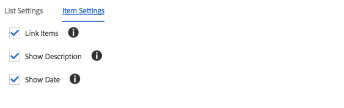

# 列出元件{#list-component}

「核心元件清單元件」可讓您輕鬆建立動態和靜態清單。

## 使用狀況 {#usage}

「清單元件」可用來建立例如子頁面的動態清單或任意定義項目的靜態清單。 可用清單類型和格式選項可由模板作者在設計對話框中定 [義](#design-dialog)。 內容編輯器可以從可用的清單類型中選擇，以及如何在編輯對話框中格式化列 [表元素](#edit-dialog)。

## 版本與相容性 {#version-and-compatibility}

目前的清單元件版本為v2，此版本於2018年1月隨核心元件2.0.0版推出，並在本檔案中加以說明。

下表詳細說明所有支援的元件版本、與元件版本相容的AEM版本，以及舊版檔案的連結。

| 元件版本 | AEM 6.3 | AEM 6.4 | AEM 6.5 |
|--- |--- |--- |--- |
| v2 | 相容 | 相容 | 相容 |
| [v1](list-v1.md) | 相容 | 相容 | 相容 |

如需核心元件版本與版本的詳細資訊，請參閱檔案核 [心元件版本](versions.md)。

## 元件輸出示例 {#sample-component-output}

若要體驗「清單元件」，並檢視其設定選項以及HTML和JSON輸出的範例，請造訪「元件 [庫」](http://opensource.adobe.com/aem-core-wcm-components/library/list.html)。

### 技術詳細資訊 {#technical-details}

有關List Component的最新技術檔案 [可在GitHub上找到](https://github.com/adobe/aem-core-wcm-components/blob/master/content/src/content/jcr_root/apps/core/wcm/components/list/v2/list)。

有關開發核心元件的詳細資訊，請參閱核心元 [件開發人員檔案](developing.md)。

## Edit Dialog {#edit-dialog}

編輯對話框允許內容作者配置清單和清單項。

### 清單設定標籤 {#list-settings-tab}

清單可以以不同的方式建立。

* [子頁面](#child-pages)
* [固定清單](#fixed-list)
* [搜尋](#search-options)
* [標記](#tags)

無論清單的建立方式為何，都有 [可隨時設定的排序選項](#sort-options) 。

視內容作者選擇如何建立清單而定，其他設定選項將會變更。

#### 子頁面 {#child-pages}

清單可由目前頁面或其他頁面的子頁面建立。

* **父頁面**
   * 其子頁面應該列出的頁面
   * 保留空白以使用目前頁面

* **子層深**&#x200B;度應使用階層中向下的層數

#### Fixed List {#fixed-list}

清單可使用固定的項目清單來建立。

點選或按一下「 **新增** 」按鈕，將新項目插入清單。

* 在清單中輸入項目的文字，或使用「選 **取對話方** 」從AEM選擇項目。
* 使用拖動控制滑塊重新排列清單中的項目。
* 使用垃圾桶圖示來刪除清單中的項目。

#### 搜尋 {#search-options}

您可使用搜尋AEM內容的結果來建立清單。

* **搜尋查**&#x200B;詢要執行全文搜尋以產生清單元素的字串
* **搜索**&#x200B;應在何處運行搜索
   * 使用「選 **取對話方** 」來選擇AEM中的位置
   * 如果保留空白，請使用目前頁面

#### 標記 {#tags}

清單可使用與特定位置下的特定標籤相符的頁面來建立。

* **上層頁**&#x200B;面：標籤符合的起始位置
   * 使用「選 **取對話方** 」來選擇AEM中的位置
   * 如果保留空白，請使用目前頁面
* **標籤**&#x200B;哪些標籤應符合
   * 使用「瀏 **覽** 」對話框選擇標籤
* **比**&#x200B;對定義哪些比對類型可限定要包含在清單中的頁面
   * **任何標記**
   * **所有標記**

#### 排序選項 {#sort-options}

無論您選擇如何建立清單，都有某些排序選項可隨時定義。

* **排序依**&#x200B;據元素的排序方式
   * **標題**
   * **上次修改日期**
* **排序順**&#x200B;序物料的排序順序
   * **升序**
   * **降序**
* **最大項目**&#x200B;清單中顯示的項目數上限。
   * 留空以傳回所有項目。

### 項目設定標籤 {#item-settings-tab}

使用「項目設定」標籤，可以設定清單元素的格式。

* **連結項目**&#x200B;連結項目至對應頁面
* **顯示說明**&#x200B;顯示連結項目的說明
* **顯示日期**&#x200B;顯示連結項的修改日期

## 設計對話框 {#design-dialog}

設計對話方塊可讓範本作者定義內容作者應允許的清單類型以及可用的項目設定。

### 清單設定 {#list-settings}

在「清 **單設定** 」索引標籤上，可以定義日期格式，以及內容作者應在元件中使用哪些類型的清單。

* **日期格**&#x200B;式用於顯示上次修改日期的格式
* **禁用子項**&#x200B;禁用元件中的子項清單類型
* **禁用靜態**&#x200B;禁用元件中的靜態清單類型
* **禁用搜索**&#x200B;禁用元件中的搜索清單類型
* **停用元件中**&#x200B;的標籤停用標籤清單類型

### 項目設定 {#item-settings}

在「項 **目設定** 」標籤上，可定義內容作者的元件中應提供的個別清單元素的格式選項。

* **「連結項目**」「在編輯對話框中啟用鏈 [接項目」選項](#edit-dialog)
* **在編輯對話**&#x200B;框中顯示說明啟用顯示說 [明選項](#edit-dialog)
* **在編輯對話**&#x200B;框中顯示日期啟用顯 [示日期選項](#edit-dialog)

### 樣式標籤 {#styles-tab}

影像元件支援AEM [Style系統](authoring.md#component-styling)。