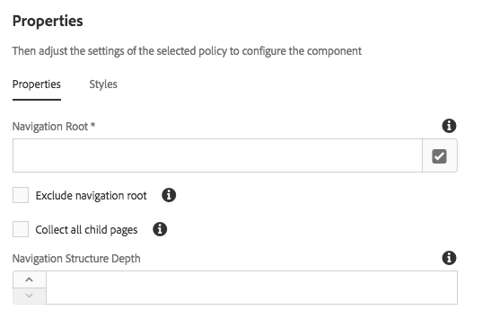

# Navigation Component{#navigation-component}

導覽元件可讓使用者輕鬆導覽全球化的網站結構。

## 使用狀況 {#usage}

導覽元件可讓任何導覽階層建立在藍圖的即時副本中，從語言的副本或簡單的頁面樹狀結構建立。它可讓頁面使用者輕鬆瀏覽網站結構。

[編輯對話方塊](#edit-dialog) 可讓內容作者定義導覽根頁面以及導覽深度。[設計對話方塊](#design-dialog) 可讓範本作者定義導覽根目錄和深度的預設值。

## Version and Compatibility {#version-and-compatibility}

目前版本的Navigation Component is v1，它是從2018年月發行的版本2.0.0推出，並在本文中說明。

下表列出元件的所有支援版本、元件版本與元件相容的AEM版本，以及舊版文件的連結。

| 元件版本 | AEM6.3 | AEM6.4 | AEM6.5 |
|--- |--- |--- |--- |
| v1 | 相容相容性 | 相容相容性 | 相容相容性 |

For more information about Core Component versions and releases, see the document [Core Components Versions](versions.md).

## Sample Component Output {#sample-component-output}

To experience the Navigation Component as well as see examples of its configuration options as well as HTML and JSON output, visit the [Component Library](http://opensource.adobe.com/aem-core-wcm-components/library/navigation.html).

## Technical Details {#technical-details}

The latest technical documentation about the Navigation Component [can be found on GitHub](https://github.com/adobe/aem-core-wcm-components/blob/master/content/src/content/jcr_root/apps/core/wcm/components/navigation/v1/navigation).

Further details about developing Core Components can be found in the [Core Components developer documentation](developing.md).

>[!NOTE]
>
>As of Core Components release 2.1.0, the Navigation Component supports [schema.org microdata](https://schema.org).

## Edit Dialog {#edit-dialog}

在編輯對話方塊中，內容作者可定義導覽的根頁面和導覽結構深度。

* **導覽根目錄**：將用來產生導覽樹狀結構的根頁面。
* **排除導覽根目錄** 排除產生的樹狀結構中的導覽根目錄，僅包含其子系。
* **收集所有子頁面** 收集所有屬於導覽根目錄子項的頁面。
* **導覽結構深度** 定義元件相對於導覽根目錄應該顯示的導覽樹狀結構層級層級(僅當 **未選取所有子系頁面** 時可用)。

## Design Dialog {#design-dialog}

此設計對話方塊可讓範本作者為內容作者設定導覽根頁面和導覽深度的預設值。

### Properties Tab {#properties-tab}

* **導覽根目錄：** 導覽結構的根頁面預設值，此值將用於產生導覽樹狀結構，並在內容作者新增元件至頁面時預設。
* **排除導覽根目錄**：選項的預設值，可排除產生之樹狀結構中的導覽根目錄。
* **收集所有子頁面** 的選項預設值可收集導覽根目錄中所有屬於子項的頁面。
* **導覽結構深度** 導覽結構深度的預設值。

### Styles Tab {#styles-tab}

The Navigation Component supports the AEM [Style System](authoring.md#component-styling).