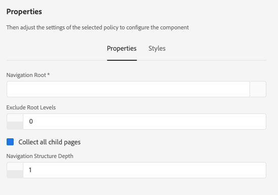

# 導覽元件{#navigation-component}

導覽元件可讓使用者輕鬆導覽全球化網站結構。

## 使用狀況 {#usage}

導覽元件會列出頁面樹狀結構，讓網站的使用者可輕鬆導覽網站結構。

導覽元件可自動偵測您網站的全球化網站結構，並自 [動調整至本地化頁面。](#localized-site-structure) 此外，它可支援任何任意的網站結構，方 [法是使用陰影重新導向頁面](#shadow-structure) ，來表示除主要內容結構以外的其他結構。

編輯 [對話方塊](#edit-dialog) ，可讓內容作者定義導覽根頁面以及導覽深度。 設 [計對話框](#design-dialog) ，可讓範本作者定義導覽根和深度的預設值。

## 本地化網站結構支援 {#localized-site-structure}

網站通常針對不同地區提供多種語言版本。 通常，每個本地化頁面都會包含作為頁面範本一部分的導覽元素。 「導覽元件」可讓您將它放置在網站所有頁面的範本上一次，然後它會根據您的全球化網站結構自動調整個別本地化頁面。

* 如需導覽元件本地化功能的範例，請參 [閱下節](#example-localization)。
* 如需核心元件的本地化功能如何搭配運作的範例，請參閱核 [心元件的本地化功能頁面](localization.md)。

### 例如 {#example-localization}

假設您的內容看起來像這樣：

```
/content
+-- we-retail
   +-- language-masters
      +-- de
         \-- experience
            \-- arctic-surfing-in-lofoten
      +-- en
         \-- experience
            \-- arctic-surfing-in-lofoten
      +-- es
      +-- fr
      \-- it
   +-- us
      +-- en
         \-- experience
            \-- arctic-surfing-in-lofoten
      \-- es
   \-- ch
      +-- de
         \-- experience
            \-- arctic-surfing-in-lofoten
      +-- fr
      \-- it
+-- wknd-events
\-- wknd-shop
```

對於網站We.Retail，您可能會想將導覽元件置於頁面範本上，做為頁首的一部分。 範本一經包含，您就可將元件的 **Navigation Root** （導覽根目錄）設 `/content/we-retail/language-masters/en` 定為，因為此處就是該網站的主版內容的開始位置。 您可能也想要將「導覽結構深度」設 ****`2` 為，因為您可能不希望元件顯示整個內容樹狀結構，而是前兩個層級，以做為總覽。

使用導 **覽根** (Navigation Root `/content/we-retail/language-masters/en` )值，導覽元件會知道，在導覽開始後，它可以透過向下遞歸網站結構兩個層級(由導覽結構深度( **Navigation Structure Depth** )值定義)來產生導覽選項。

無論使用者檢視的是哪個本地化頁面，Navigation元件都能透過知道目前頁面的位置、向後工作至根目錄，然後轉送至對應的頁面，來尋找對應的本地化頁面。

因此，如果訪客正在檢 `/content/ch/de/experience/arctic-surfing-in-lofoten`視，元件會知道根據產生導覽結構 `/content/we-retail/language-masters/de`。 同樣地，如果訪客正在檢 `/content/us/en/experience/arctic-surfing-in-lofoten`視，元件也會根據產生導覽結構 `/content/we-retail/language-masters/en`。

## 陰影網站結構支援 {#shadow-structure}

有時，必須為訪客建立不同於實際網站結構的導覽功能表。 或許促銷活動應重新排列內容清單，以反白顯示功能表中的特定內容。 使用陰影頁面（只會重新導向至其他內容頁面），導覽元件可產生任何必要的任意導覽結構。

若要這麼做，您必須：

1. 將陰影頁面建立為代表您所需網站結構的空白頁面。 這通常稱為陰影網站結構。
1. 在這些頁 **面的頁面屬性中** ，設定「重新導向」值，以指向實際的內容頁面。
1. 在陰影頁 **面的頁面屬性中** ，設定「在導覽中隱藏」選項。
1. 將導 **** 覽元件的導覽根目錄值設為指向新陰影網站結構的根目錄。

然後，「導覽元件」會根據陰影網站結構來轉換功能表。 元件轉譯的連結是實際內容頁面，陰影頁面會重新導向至實際內容頁面，而非陰影頁面本身。 此外，元件會顯示實際頁面的名稱，並正確反白顯示作用中頁面，即使導覽是以陰影頁面為基礎。 導覽元件可讓陰影頁面對訪客完全透明。

>[!NOTE]
>陰影頁面可讓您的導覽選項更有彈性，但請記住，此結構的維護是完全手動的。 如果您重新排列實際的網站內容或新增／移除內容，則需要視需要手動更新陰影結構。

>[!NOTE]
>在呈現陰影網站結構時，導覽邏輯只會遞回陰影網頁。 該邏輯不會重複重新導向目的地的結構。

## 版本與相容性 {#version-and-compatibility}

目前的導覽元件版本為v1，此版本於2018年1月隨核心元件2.0.0版推出，並在本檔案中加以說明。

下表詳細說明所有支援的元件版本、與元件版本相容的AEM版本，以及舊版檔案的連結。

| 元件版本 | AEM 6.3 | AEM 6.4 | AEM 6.5 | AEM As a Cloud Service |
|--- |--- |--- |--- |---|
| v1 | 相容 | 相容 | 相容 | 相容 |

如需核心元件版本與版本的詳細資訊，請參閱檔案核 [心元件版本](versions.md)。

## 元件輸出示例 {#sample-component-output}

若要體驗導覽元件，並檢視其設定選項以及HTML和JSON輸出的範例，請造訪元 [件庫](https://adobe.com/go/aem_cmp_library_navigation)。

## 技術詳細資訊 {#technical-details}

有關Navigation Component的最新技術文 [件可在GitHub上找到](https://adobe.com/go/aem_cmp_tech_navigation_v1)。

有關開發核心元件的詳細資訊，請參閱核心元 [件開發人員檔案](developing.md)。

>[!NOTE]
>
>自2.1.0版核心元件起，導覽元件支援 [schema.org微資料](https://schema.org)。

## Edit Dialog {#edit-dialog}

在編輯對話方塊中，內容作者可以定義導覽的根頁面，以及導覽結構的深度。

### 屬性標籤 {#properties-tab}


* **導覽根** -將用於產生導覽樹的根頁面。
* **排除根層級** -導覽中通常不應包含根層級。 此選項可讓您指定要從根目錄上排除的層數。 例如：
   * 0 =顯示根級別
   * 1 =排除根層級
   * 2 =排除根目錄和1個以上層級
   * 等等。
* **收集所有子頁面** -收集所有作為導覽根目錄子體的頁面。
* **導覽結構深度** -定義元件在導覽樹狀結構下應相對於導覽根目錄顯示多少層次(僅當未選取「收集所有子頁面 **** 」時可用)。

### 「輔助工具」頁籤 {#accessibility-tab}


在「協 **助工具** 」標籤上，可為元件的 [](https://www.w3.org/WAI/standards-guidelines/aria/) ARIA協助工具標籤設定值。

* **Label** —— 元件的ARIA label屬性的值

## 設計對話框 {#design-dialog}

設計對話框允許模板作者設定顯示給內容作者的導航根頁面和導航深度的預設值。

### 屬性標籤 {#properties-tab-design}



* **導覽根** -導覽結構的根頁面的預設值，此值將用於產生導覽樹，並在內容作者將元件新增至頁面時預設。
* **排除根層級** -導覽中通常不應包含根層級。 此選項可讓您指定您要排除之根目錄上限的預設值。 例如：
   * 0 =顯示根級別
   * 1 =排除根層級
   * 2 =排除根目錄和1個以上層級
   * 等等。
* **收集所有子頁面** -用於收集所有作為導航根目錄後代的頁面的選項的預設值。
* **導覽結構深度** -導覽結構深度的預設值。

### 樣式標籤 {#styles-tab}

導覽元件支援AEM [Style系統](authoring.md#component-styling)。
