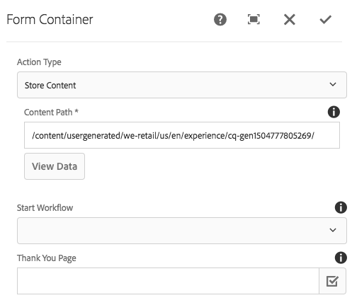

# 頁面元件{#page-component}

「頁面元件」是可擴充的頁面元件，可與範本編輯器搭配使 [用](https://helpx.adobe.com/experience-manager/6-5/sites/authoring/using/templates.html) ，並可讓頁首／頁尾和結構元件與範本編輯器組合。

## 使用狀況 {#usage}

頁面元件構成所有使用核心元件設計的頁面以及可編輯的範本。 使用頁面元件，頁首、頁尾和頁面結構就可使用其他核心元件定義為範本。

使用設 [計對話方塊](#design-dialog)，可為頁面定義自訂用戶端程式庫。 與具有可直接從元件訪問的編輯對話框的其他元件不同，由於元件是頁面本身，因此頁面元件的 [編輯](#edit-dialog) 對話框是頁面屬性窗口。

## 版本與相容性 {#version-and-compatibility}

目前的頁面元件版本為v2，此版本於2018年1月隨核心元件2.0.0版推出，並在本檔案中加以說明。

下表詳細說明所有支援的元件版本、與元件版本相容的AEM版本，以及舊版檔案的連結。

| 元件版本 | AEM 6.3 | AEM 6.4 | AEM 6.5 |
|---|---|---|---|
| [v2](page-v1.md) | 相容 | 相容 | 相容 |
| v1 | 相容 | 相容 | 相容 |

如需核心元件版本與版本的詳細資訊，請參閱檔案核 [心元件版本](versions.md)。

>[!NOTE]
>
>若要啟用頁 `cq:Page` 面元件第2版和AEM 6.3的重新導向， [需要Service Pack 2](https://helpx.adobe.com/experience-manager/6-3/release-notes/sp2-release-notes.html) 或更新版本。 舊版中未提供此類重新導向。

## 元件輸出示例 {#sample-component-output}

以下是 [We.Retail的範例](https://helpx.adobe.com/experience-manager/6-5/sites/developing/using/we-retail.html)。

### 螢幕擷圖 {#screenshot}

### 技術詳細資訊 {#technical-details}

有關頁面元件的最新技術文 [件可在GitHub上找到](https://github.com/adobe/aem-core-wcm-components/blob/master/content/src/content/jcr_root/apps/core/wcm/components/page/v2/page)。

有關開發核心元件的詳細資訊，請參閱核心元 [件開發人員檔案](developing.md)。

## Edit Dialog {#edit-dialog}

由於元件代表整個頁面，因此「頁面屬性」視窗中會顯示一般會出現在編輯對話 [方塊中的設定](https://helpx.adobe.com/experience-manager/6-5/sites/authoring/using/editing-page-properties.html) 。

## 設計對話框 {#design-dialog}

由於元件代表整個頁面，因此在編輯頁面範本時，可透過「頁面資訊-&gt;頁 **面原則** 」存取設計對話方塊。

>[!NOTE]
>
>在舊版AEM中，「頁 **面原則** 」稱 **為「頁面設計」**。

### 屬性標籤 {#properties-tab}

使用「頁面設計」視窗，您可以定義要載入的用戶端程式庫以及頁面的網頁資源程式庫。

* **Client Libraries**（用戶端程式庫）這會定義要載入的用戶端程式庫類別。 JavaScript會新增至內文結尾，而CSS則會新增至頁面標題。
* **用戶端程式庫JavaScript頁面標**&#x200B;頭這會定義要載入頁面標頭中的JavaScript用戶端程式庫類別。
   * 此處定義的類別也存在於「用戶端程式庫」 **欄位中** ，其JavaScript將載入頁面標題中，而非載入內文結尾。
   * 除非「用戶端程式庫」欄位中也有類別，否則不會載入 **任何CSS** 。

* **Web資源客戶端庫**&#x200B;用於提供Web資源（如Favicon）的客戶端庫類別。

可以為「客戶端庫」和「 **客戶端庫** 」「 **** JavaScript頁首」欄位配置庫，如下所示：

* 若要新增欄位，請按一下或點選欄 **位下方** 的「新增」按鈕。
* 若要移除欄位點按或點選要移除欄位旁的垃圾桶圖示。
* 若要重新排列載入順序，請按一下或點選並拖曳要移動之欄位旁的控點。

如需使用用戶端程式庫的詳細資訊，請參 [閱使用用戶端程式庫](https://helpx.adobe.com/experience-manager/6-5/sites/developing/using/clientlibs.html)。

>[!CAUTION]
>
>核心元件版本2.2.0中，已引入為頁首個別定義用戶端程式庫的功能。

### 樣式標籤 {#styles-tab}

「頁面元件」支援AEM [Style系統](authoring.md#component-styling)。