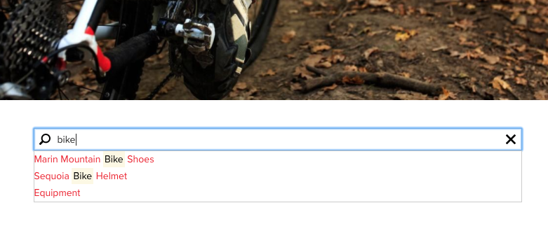

# 快速搜尋元件{#quick-search-component}

「快速搜尋元件」提供搜尋功能至網站並呈現搜尋結果，讓訪客輕鬆找到符合的內容並檢視結果。

## 使用狀況 {#usage}

「快速搜尋」元件可讓網站訪客搜尋內容、就地檢視結果，並輕鬆導覽至相符頁面。當使用者捲動搜尋結果時，會動態擷取新結果。

[編輯對話方塊](#edit-dialog) 可讓內容作者定義搜尋應該開始的內容樹狀結構中的位置。使用 [設計對話方塊](#design-dialog)，範本作者可以設定搜尋應該開始的內容樹狀結構中的預設值，以及最大結果集大小和最小搜尋詞長度。

## 版本與相容性 {#version-and-compatibility}

目前版本的Quick Search Component is v1，它是在2018年月發行的版本2.0.0推出，並在本文中說明。

下表列出元件的所有支援版本、元件版本與元件相容的AEM版本，以及舊版文件的連結。

| 元件版本 | AEM6.3 | AEM6.4 | AEM6.5 |
|--- |--- |--- |--- |
| v1 | 相容相容性 | 相容相容性 | 相容相容性 |

如需核心元件版本和版本的詳細資訊，請參閱文件 [核心元件版本](versions.md)。

## 元件輸出範例 {#sample-component-output}

以下是取自 [「我們零售](https://helpx.adobe.com/experience-manager/6-5/sites/developing/using/we-retail.html)業」的範例。

### 螢幕擷圖 {#screenshot}



### HTML {#html}

```
<section class="cmp-search" role="search" data-cmp-is="search" data-cmp-min-length="3" data-cmp-results-size="10">
    <form class="cmp-search__form" data-cmp-hook-search="form" method="get" action="/content/we-retail/us/en/equipment.searchresults.json/_jcr_content/root/responsivegrid/search" autocomplete="off">
        <div class="cmp-search__field">
            <i class="cmp-search__icon" data-cmp-hook-search="icon"></i>
            <span class="cmp-search__loading-indicator" data-cmp-hook-search="loadingIndicator"></span>
            <input class="cmp-search__input" data-cmp-hook-search="input" type="text" name="fulltext" placeholder="Search" role="combobox" aria-autocomplete="list" aria-haspopup="true" aria-invalid="false">
            <button class="cmp-search__clear" data-cmp-hook-search="clear">
                <i class="cmp-search__clear-icon"></i>
            </button>
        </div>
    </form>
    <div class="cmp-search__results" data-cmp-hook-search="results" role="listbox" aria-multiselectable="false"></div>
    
<script data-cmp-hook-search="itemTemplate" type="x-template">
    <a class="cmp-search__item" data-cmp-hook-search="item">
        <span class="cmp-search__item-title" data-cmp-hook-search="itemTitle"></span>
    </a>
</script>
</section>
```

### JSON {#json}

```
"search":{  
                     "columnClassNames":"aem-GridColumn aem-GridColumn--default--12",
                     "relativePath":"/jcr:content/root/responsivegrid/search",
                     "resultsSize":10,
                     "searchTermMinimumLength":3,
                     ":type":"core/wcm/components/search/v1/search"
                  }
```

### 技術細節 {#technical-details}

>[!NOTE]
>
>保護搜尋元件或任何AEM基於DOS攻擊的應用程式應在較高等級實施，例如在 `mod_security` 傳送時使用。

有關Quick Search Component [的最新技術文件，請參閱GitHub](https://github.com/adobe/aem-core-wcm-components/blob/master/content/src/content/jcr_root/apps/core/wcm/components/search/v1/search)。

有關開發核心元件的詳細資訊，請參閱 [核心元件開發人員文件](developing.md)。

## 編輯對話方塊 {#edit-dialog}

編輯對話方塊可讓內容作者定義搜尋應該開始的內容樹狀結構中的位置。


**搜尋根目錄** -從何處開始搜尋的根頁面。搜尋根目錄可以是藍圖主頁、語言主版或一般頁面。

## 設計對話方塊 {#design-dialog}

使用設計對話方塊，範本作者可以設定搜尋應開始的內容樹狀結構中的預設值，以及最大的搜尋字詞集大小和最小搜尋字詞長度。設計對話方塊可讓範本作者定義哪些文字格式化選項可供內容作者使用。

### 屬性索引標籤 {#properties-tab}


* **搜尋根目錄**當內容作者將「快速搜尋元件」置於內容頁面上時，搜尋根目錄的預設值
* **結果大小**搜尋請求擷取的結果數目上限
* **搜尋詞最小長度**長度下限搜尋詞的最小長度

>[!NOTE]
>
>**結果大小** 和 **搜尋詞最小長度只** 能在設計模式中設定，因此僅能在範本層級設定，也就是說內容作者無法修改這些值。

>[!CAUTION]
>
>**「結果大小」** 和 **「搜尋詞最小長度** 」若設定過高或過低，可能會影響效能。

### 樣式標籤 {#styles-tab}

快速搜尋元件支援AEM [樣式系統](authoring.md#component-styling)。