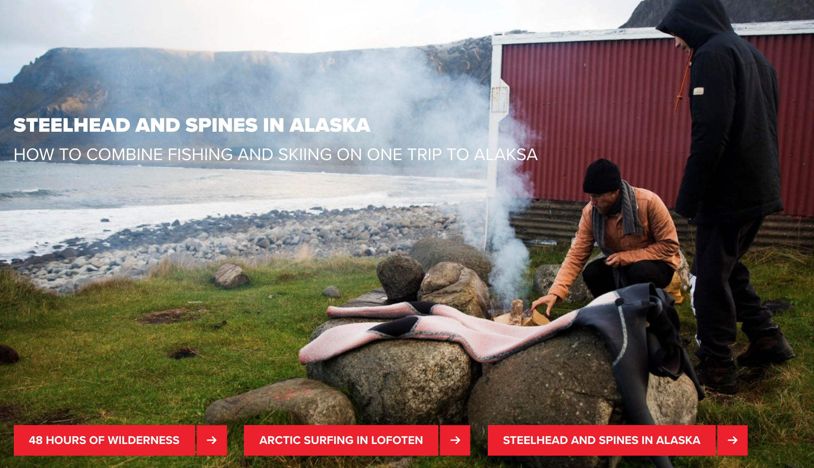
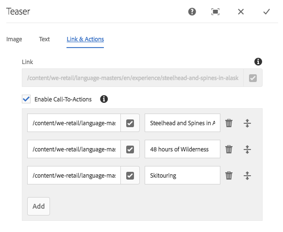

# 摘要元件{#teaser-component}

核心元件摘要元件可顯示影像、標題、豐富文字，並可選擇性地連結至其他內容。

## 使用狀況 {#usage}

Teaser Component可讓內容作者使用影像、標題或豐富文字，並連結到更進一步的內容或其他動作，輕鬆製作出更進一步的內容。

範本作者可以使用 [設計對話方塊](#design-dialog) 來定義要建立呼叫動作並新增連結的選項，以及停用各種顯示選項。內容作者可以使用 [設定對話方塊](#configure-dialog) 設定影像、定義CTA、設定標題和說明，以及設定個別摘要的連結。您 [可以存取](image.md#edit-dialog)[影像元件](image.md) 的編輯對話方塊，修改摘要影像。

## 版本與相容性 {#version-and-compatibility}

目前的Teaser元件版本是v1，它是在2018年月發行的版本2.1.0版中推出，並在本文中說明。

下表列出元件的所有支援版本、元件版本與元件相容的AEM版本，以及舊版文件的連結。

| 元件版本 | AEM6.3 | AEM6.4 | AEM6.5 |
|---|---|---|---|
| v1 | 相容相容性 | 相容相容性 | 相容相容性 |

## 元件輸出範例 {#sample-component-output}

以下是取自 [「我們零售](https://helpx.adobe.com/experience-manager/6-5/sites/developing/using/we-retail.html)業」的範例。

### 螢幕擷圖 {#screenshot}

### 元件庫

若要體驗Teaser元件，以及檢視其組態選項以及HTML和JSON輸出的範例，請造訪 [元件庫](http://opensource.adobe.com/aem-core-wcm-components/library/teaser.html)。

### 技術細節 {#technical-details}

有關Teaser Component的 [最新技術文件，請參閱GitHub](https://github.com/adobe/aem-core-wcm-components/blob/master/content/src/content/jcr_root/apps/core/wcm/components/teaser/v1/teaser)。

有關開發核心元件的詳細資訊，請參閱 [核心元件開發人員文件](developing.md)。

## 設定對話方塊 {#configure-dialog}

內容作者可以使用設定對話方塊來定義個別摘要的屬性。如果已選取，也有 [編輯對話框](#edit-dialog) 可修改摘要影像。

### 影像 {#image}

* **影像資產**
   * 從 [資產瀏覽器拖曳資產，](https://helpx.adobe.com/experience-manager/6-5/sites/authoring/using/author-environment-tools.html) 或點選 **瀏覽** 選項以從本機檔案系統上傳。
   * 點選或按一下 **清除** ，以取消選取目前選取的影像。
   * 點選或按一下 **「編輯** 」，在資產編輯器中 [插入資產](https://helpx.adobe.com/experience-manager/6-5/assets/using/managing-assets-touch-ui.html) 的轉譯。

### 文字 {#text}

* **標題**定義標題，以做為摘要的標題。
* **從連結頁面**取得標題時，此標題會填入連結頁面的標題。
* **說明**定義要顯示為摘要子標題的說明。
* **從連結頁面**取得描述時，此說明會填入連結頁面的說明。

### 連結與動作 {#links-actions}

* **套用至摘要的連結**連結。使用路徑瀏覽器來選取連結目標。
* **啓用呼叫動作：**勾選時，啓用「呼叫動作」的定義。清單中的第一個「呼叫對動作」連結會用作其他摘要元素的連結。

## 編輯對話方塊 {#edit-dialog}

Teaser元件會委派影像元件 [的影像呈現](image.md)。因此 [，編輯對話方塊](影像元件的image. md# Edit-dialog)會提供給內容作者來控制摘要影像。

## 設計對話方塊 {#design-dialog}

設計對話方塊可讓範本作者定義使用此元件時，內容作者所擁有的摘要選項。

### 摘要索引標籤 {#teaser-tab}

* **呼叫動作**
   * **停用呼叫動作**隱藏內容作者 **的呼叫動作動作** 選項
* **元素**
   * **隱藏標題**
      * 隱藏內容作者的 **「標題** 」選項
      * 選取 **「標題類型」** 時，隱藏
   * **隱藏說明**隱藏內容作者 **的描述** 選項
* **標題類型**定義摘要標題要使用的H標記。
* **連結**
   * **未連結影像**時，選取的摘要影像未連結
   * **不連結標題**時，選取的摘要標題不會連結

### 樣式標籤 {#styles-tab}

Teaser元件支援AEM [樣式系統](authoring.md#component-styling)。
