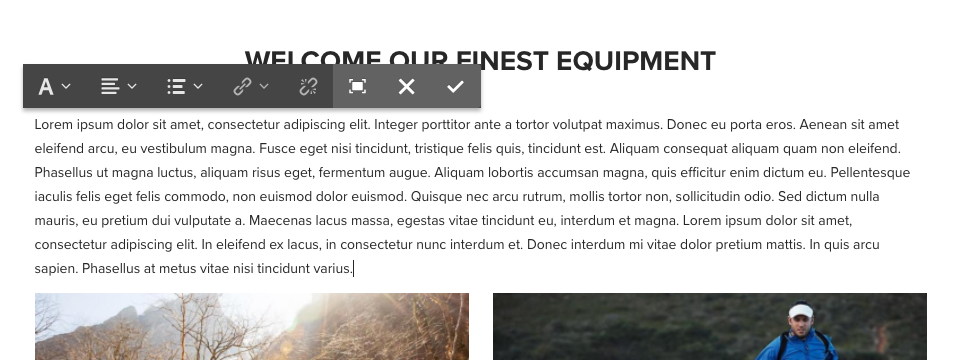
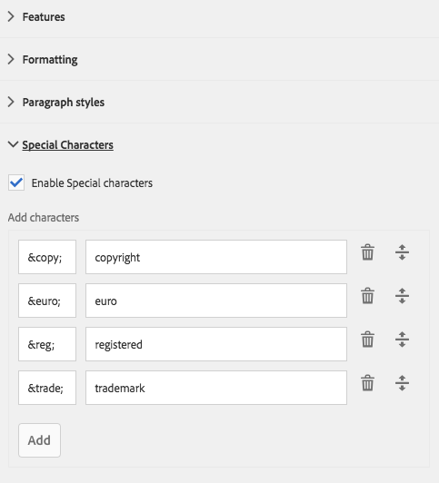

# 文字元件(v1){#text-component-v}

「文字元件」是富格文字編輯和合成元件，具備就地編輯功能。

## 使用狀況 {#usage}

文字元件提供強穩的豐富式文字編輯器，讓您在簡化的內嵌編輯器中，以及全螢幕格式輕鬆編輯文字。

「編 [輯」對話框](text-v1.md#main-pars_title) ，其特徵是使用有限的選項進行串聯編輯，而全螢幕編輯對話框中提供完整功能。 使用設 [計對話框](text-v1.md#main-pars_title_1995166862)，可以為內容作者的模板配置文本格式選項，如標題、特殊字元和段落樣式。

## 版本與相容性 {#version-and-compatibility}

本檔案說明第1版文字元件，最初是隨AEM 6.3版核心元件一起推出。

下表列出文本元件v1的相容性。

| AEM版本 | 文字元件v1 |
|--- |--- |
| 6.3 | 相容 |
| 6.4 | 相容 |

>[!CAUTION]
>
>本檔案說明文字元件的v1。
>
>有關文本元件的當前版本的詳細資訊，請參閱 [文本元件文檔](text.md) 。

## 元件輸出示例 {#sample-component-output}

以下是 [We.Retail的範例](https://helpx.adobe.com/experience-manager/6-4/sites/developing/using/we-retail.html)。

### 螢幕擷圖 {#screenshot}


### HTML {#html}

```
<div class="cmp cmp-text aem-GridColumn aem-GridColumn--default--12">
<p>Lorem ipsum dolor sit amet, consectetur adipiscing elit. Integer porttitor ante a tortor volutpat maximus. Donec eu porta eros. Aenean sit amet eleifend arcu, eu vestibulum magna. Fusce eget nisi tincidunt, tristique felis quis, tincidunt est. Aliquam consequat aliquam quam non eleifend. Phasellus ut magna luctus, aliquam risus eget, fermentum augue. Aliquam lobortis accumsan magna, quis efficitur enim dictum eu. Pellentesque iaculis felis eget felis commodo, non euismod dolor euismod. Quisque nec arcu rutrum, mollis tortor non, sollicitudin odio. Sed dictum nulla mauris, eu pretium dui vulputate a. Maecenas lacus massa, egestas vitae tincidunt eu, interdum et magna. Lorem ipsum dolor sit amet, consectetur adipiscing elit. In eleifend ex lacus, in consectetur nunc interdum et. Donec interdum mi vitae dolor pretium mattis. In quis arcu sapien. Phasellus at metus vitae nisi tincidunt varius.<br />
</p>
</div>
```

### JSON {#json}

```
"text": {
              "columnClassNames": "aem-GridColumn aem-GridColumn--default--12",
              "text": "<p>Lorem ipsum dolor sit amet, consectetur adipiscing elit. Integer porttitor ante a tortor volutpat maximus. Donec eu porta eros. Aenean sit amet eleifend arcu, eu vestibulum magna. Fusce eget nisi tincidunt, tristique felis quis, tincidunt est. Aliquam consequat aliquam quam non eleifend. Phasellus ut magna luctus, aliquam risus eget, fermentum augue. Aliquam lobortis accumsan magna, quis efficitur enim dictum eu. Pellentesque iaculis felis eget felis commodo, non euismod dolor euismod. Quisque nec arcu rutrum, mollis tortor non, sollicitudin odio. Sed dictum nulla mauris, eu pretium dui vulputate a. Maecenas lacus massa, egestas vitae tincidunt eu, interdum et magna. Lorem ipsum dolor sit amet, consectetur adipiscing elit. In eleifend ex lacus, in consectetur nunc interdum et. Donec interdum mi vitae dolor pretium mattis. In quis arcu sapien. Phasellus at metus vitae nisi tincidunt varius.</p>\n",
              "richText": true,
              ":type": "weretail/components/content/text"
            }
```

>[!NOTE]
>
>從核心元件匯出JSON需要1.1.0版的核心元件。 如需詳細 [資訊，請參閱核心元件v1的相容性資訊](versions.md#main-pars_title_236368006) 。

## Edit Dialog {#edit-dialog}

編輯對話方塊提供使用者預期要合成文字的標準豐富文字格式工具。


* 粗體

   

   用於將粗體格式套用至選取的文字，或大膽格式化游標後輸入的文字。

   **Ctrl+B** 可用作鍵盤快速鍵。

* 斜體

   

   用於將斜體格式套用至選取的文字或在游標後輸入的斜體文字。

   **Ctrl+I** 可用作鍵盤快速鍵。

* 底線

   

   用於將帶下划線的格式應用於在游標後輸入的選定文本或下划線文本。

   **Ctrl+U** 可用作鍵盤快速鍵。

* 下標

   

   用於將游標之後輸入的選定文本或文本格式化為下標。

* 上標

   

   用於將游標之後輸入的選定文本或文本格式化為上標。

* 貼上為文字

   

   將任何複製的文字貼上為純文字，不需任何格式。

   選取此選項時，會開啟一個視窗，在此視窗中，文字可以貼上為純文字，在插入文字之前，不會以預覽格式加入。 點選或按一下核取標籤即可接受，點選或按一下x即可取消。

   

* 從 Word 貼上

   

   選取此選項時，會開啟一個視窗，可在其中貼上文字，並保留其格式為預覽，然後再將它插入文字。 點選或按一下核取標籤即可接受，點選或按一下x即可取消。

   

* 超連結

   

   使用此選項可將選取的文字轉換為超連結，或修改已定義的連結。 只有在已選取文字並開啟視窗時，此選項才會生效，視窗中會有其他設定連結的選項。

   

   * 輸入位置

      * 使用「開啟選取範圍」對話方塊，在AEM中選擇路徑
      * 如果連結不在AEM中，請輸入絕對URL（非絕對路徑會解譯為相對於AEM）
   * 輸入連結的替代描述性文本
   * 選取連結行為

      * 目標
      * 相同索引標籤
      * 新索引標籤
      * 父框架
      * 上框架
   點選或按一下核取標籤，以套用連結或x以取消。

* 取消連結

   

   使用此選項可移除已套用至選取文字的連結。 只有在已選取連結時，此選項才會生效。

* 尋找

   

   使用此選項可搜索文本以查找指定文本字串的出現次數。 選擇此選項將開啟一個窗口，用於指定搜索選項。

   

   輸入要搜索的文本並點選，或按一下「查 **找** 」開始搜索。 點選或按一下x以取消。

   如果您想根據大小寫進行完全相符，請在開始搜尋前選取「 **符合大小寫** 」選項。

   如果找到相符項目，則會反白顯示，而搜尋對話方塊會暗顯。 在暗灰色對話方 **塊中點選或再按一下** 「尋找」按鈕，以搜尋下一個出現的項目。

   

   如果找不到其他發生次數，則會顯示訊息，搜尋會從文字的開頭開始。

   

* 取代

   

   使用此選項可搜尋文字中是否出現指定的文字字串，並以其他字串取代相符項目。 選擇此選項將開啟一個窗口，用於指定搜索和替換選項。

   

   輸入要搜索的文本以及應替換的文本。

   點選或按一 **下「尋找** 」開始搜尋。 按一下或點選x以取消。

   如果您想根據大小寫進行完全相符，請在開始搜尋前選取「 **符合大小寫** 」選項。

   如果找到相符項目，則會反白顯示，而搜尋對話方塊會暗顯。 再次在灰色 **對話方塊中按一下「尋找****** 」按鈕，以搜尋下一個出現的項目，或選取「取代」按鈕以取代反白顯示的相符文字。 請注意，「取 **代** 」按鈕只有在相符後才會生效。

   選 **取「全部取代** 」，一次取代所有出現的文字。

* 向左對齊文字

   

   用來將文字與左邊距對齊。

* 文字置中

   

   用來將文字置中。

* 向右對齊文字

   

   用來將文字對齊右邊距。

* 項目符號

   

   用於將選定文本格式化為項目符號清單，或在游標後開始插入項目符號清單。

   要結束項目清單，請再次點選或按一下「項目 **符號** 」按鈕，或輸入兩個歸位符。

* 編號

   

   用於將選定文本格式化為編號清單，或在游標後開始插入編號清單。

   要結束編號清單，請再次點選或按一下「編 **號** 」按鈕，或輸入兩個歸位。

* 凸排

   

   用於減少在游標後輸入的選定文本或文本的縮進級別。

   僅當游標的選定文本或位置已縮進時才處於活動狀態。

* 縮排

   

   用於增加在游標後輸入的選定文本或文本的縮進級別。

* 表格

   

   用於將表插入文本。 選擇此選項將開啟一個窗口，用於指定表的詳細資訊。

   

   * **列** -表的列數（必需）
   * **行** -表格的行數（必需）
   * **Width** —— 表格的寬度
   * **高度** -表格的高度
   * **單元**&#x200B;格間距——單元格內容周圍的空格
   * **單元格間距** -單元格間距
   * **邊框** -表格邊框線的重量
   * 如果表的標題：

      * 應使用第一行
      * 應使用第一欄
      * 應使用第一列和第一列
      * 或者不應使用標題。
   * **標題** -表格標題


* 檢查拼字

   

   用於檢查文本內容的拼寫。 可能的拼字錯誤會加上破折的紅線。

* 特殊字元

   

   用於將特殊字元插入文字。 選取此選項會開啟顯示可用字元的視窗。

   

   點選或按一下所要的字元，將它插入游標後面的文字。 可插入多個字元。 點選或按一下x以關閉選取視窗。

* 來源編輯

   

   用於查看和修改文本的HTML源。

   點選或按一下「 **來源編輯** 」圖示，以變更格式化檢視中的文字內容，以檢視原始HTML。 在此模式下，所有其它格式設定選項都被禁用。 再次點選或按一 **下「來源編輯** 」圖示，以返回格式化檢視。

   >[!CAUTION]
   >
   >與存取原始HTML的情況一樣，使用「來源編輯」選項時 **必須小心** !
   >
   >
   >透過「來源編 **輯」輸入的HTML** ，會掃描XSS風險，並移除任何已插入的指令碼，而不會出現在產生的頁面上。 但是，在「來源編輯」中輸 **入的格式錯誤的HTML** ，可能會中斷頁面的範本，導致未預期的格式化或導致產生的頁面無法使用。

* 段落格式

   

   用於將段落格式應用於選定文本或游標後插入的文本。 選取此選項會開啟一個下拉式清單，從中選取段落格式。

   

文字元件也可以內嵌編輯，但由於空間限制，並非所有格式選項都可內嵌。 若要查看所有選項，請切換至全螢幕模式。



## 設計對話框 {#design-dialog}

設計對話方塊可讓範本作者定義哪些文字格式選項可供內容作者使用。

### 功能 {#features}


可為元件啟用或停用下列功能。

* 貼上純文字
* 過去自字詞
* 尋找和取代
* 拼字檢查程式
* 來源編輯

### 正在格式化 {#formatting}


可以為元件激活或停用以下格式設定選項。

* 表格
* 清單
* 對齊方式
* 粗體、斜體、下划線
* 連結
* 子／上標

### 段落樣式 {#paragraph-styles}


可為元件啟用或停用段落樣式。 啟動後，可定義允許的格式。

* 點選或按一下「 **新增** 」按鈕以插入新樣式。
* 輸入樣式的代碼和將在編輯對話框中顯示的說明。
* 要刪除樣式點選，或按一下「刪 **除** 」按鈕。
* 要重新排列格式的順序，請點選或按一下並拖動控點。

### 特殊字元 {#special-characters}



可以為元件激活或停用插入特殊字元的選項。 啟用後，可定義允許的字元。

* 點選或按一下「 **新增** 」按鈕以插入新字元。
* 輸入字元的HTML代碼和將在編輯對話框中顯示的說明。
* 若要移除字元點選，或按一下「刪 **除** 」按鈕。
* 若要重新排列字元點選順序，或按一下並拖曳控點。

## 技術詳細資訊 {#technical-details}

有關Text Component的最新技術檔案 [可在GitHub上找到](https://github.com/adobe/aem-core-wcm-components/tree/master/content/src/content/jcr_root/apps/core/wcm/components/text/v1/text)。

您可從GitHub下載整個核心元件專案。

有關開發核心元件的詳細資訊，請參閱核心元 [件開發人員檔案](developing.md)。
