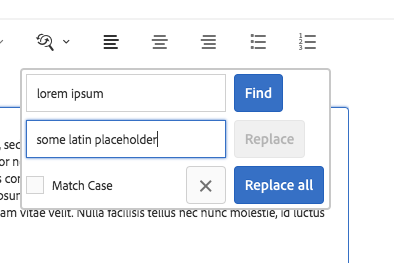

# 文字元件{#text-component}

Core Component Text Component是一種豐富的文字編輯與構圖元件，可進行就地編輯。

## 使用狀況 {#usage}

文字元件提供強穩的豐富文字編輯器，可讓您以簡化的線上編輯器以及全螢幕格式輕鬆編輯文字。

[編輯對話方塊](#edit-dialog) 使用有限選項進行線上編輯，全螢幕編輯對話方塊提供完整功能。使用 [設計對話方塊](#design-dialog)，可以為內容作者的範本設定文字格式選項，例如標題、特殊字元和段落樣式。

## 版本與相容性 {#version-and-compatibility}

目前版本的文字元件是v2，是在2018年月發行的版本2.0.0推出，並在本文中說明。

下表列出元件的所有支援版本、元件版本與元件相容的AEM版本，以及舊版文件的連結。

| 元件版本 | AEM6.3 | AEM6.4 | AEM6.5 |
|---|---|---|---|
| v2 | 相容相容性 | 相容相容性 | 相容相容性 |
| [v1](text-v1.md) | 相容相容性 | 相容相容性 | 相容相容性 |

如需核心元件版本和版本的詳細資訊，請參閱文件 [核心元件版本](versions.md)。

## 元件輸出範例 {#sample-component-output}

以下是取自 [「我們零售](https://helpx.adobe.com/experience-manager/6-5/sites/developing/using/we-retail.html)業」的範例。

### 螢幕擷圖 {#screenshot}

### 元件庫

若要體驗文字元件，以及查看其組態選項以及HTML和JSON輸出的範例，請造訪 [元件庫](http://opensource.adobe.com/aem-core-wcm-components/library/text.html)。

### 技術細節 {#technical-details}

有關文字元件 [的最新技術文件，請參閱GitHub](https://github.com/adobe/aem-core-wcm-components/blob/master/content/src/content/jcr_root/apps/core/wcm/components/text/v2/text)。

有關開發核心元件的詳細資訊，請參閱 [核心元件開發人員文件](developing.md)。

## 文字元件和Rich Text Editor {#the-text-component-and-the-rich-text-editor}

核心元件文字元件運用AEM Rich Text Editor(RTE)。RTE為內容作者提供多種功能來編輯其文字內容。RTE在其配置中非常有彈性，並提供許多選項。如需如何設定RTE的詳細資訊，請參閱 [「設定Rich Text Editor](https://helpx.adobe.com/experience-manager/6-5/sites/administering/using/rich-text-editor.html) 」和 [「Configure the Rich Text Editor增效模組](https://helpx.adobe.com/experience-manager/6-5/sites/administering/using/configure-rich-text-editor-plug-ins.html)」。

本文的其餘部分說明核心元件文字元件的標準配置，以及立即可用的RTE組態。

>[!NOTE]
>
>只有在文字元件中才能使用 [由RTE](https://chl-author-preview.corp.adobe.com/content/help/en/experience-manager/6-5/sites/administering/using/rich-text-editor.html) 設定啓用的選項。

## 編輯對話方塊 {#edit-dialog}

編輯對話方塊提供使用者預期要編寫文字的標準豐富文字格式工具。

### 粗體

用於將粗體格式套用至選取文字或游標在游標後面輸入的粗體格式文字。

**Ctrl+ B** 可當做鍵盤快速鍵使用。

### 斜體

用於將斜體格式套用至選取的文字，或在游標後面輸入斜體文字。

**Ctrl+ I** 可當做鍵盤快速鍵使用。

### 底線

用於將強調的格式套用至在游標後面輸入的選取文字或底線文字。

**Ctrl+ U** 可當做鍵盤快速鍵使用。

### 下標

用來格式化在游標後輸入的選取文字或文字。

### 上標

用來格式化在游標後面輸入的選取文字或文字作為上標。

### 貼上為文字

將任何複製的文字貼為純文字，而不需要任何格式設定。

選取此選項時，會開啓視窗，其中文字可以貼上為不含格式的純文字，並插入文字中。點選或按一下勾號即可接受，只要點選或按一下x即可取消。

### 從 Word 貼上

選取此選項時，會開啓視窗，在其中貼上文字，將其格式設為預覽，然後再插入文字中。點選或按一下勾號即可接受，只要點選或按一下x即可取消。

### 超連結

使用此選項可將選取的文字轉換為超連結，或修改已定義的連結。只有在已選取文字時才會啓用此選項，並開啓含有其他選項來設定連結的視窗。

* 輸入位置
   * 使用Open Selection對話方塊在AEM中選擇路徑
   * 如果連結不在AEM內，請輸入絕對URL(非絕對路徑被解譯為相對於AEM)
* 輸入連結的替代說明文字
* 選取連結行為
   * 目標
   * 相同索引標籤
   * 新索引標籤
   * 父框架
   * 上框架
   點選或按一下勾號以套用連結或x取消。

### 取消連結

使用此選項可移除已套用至選取文字的連結。只有在已選取連結時，才會啓用此選項。

### 尋找

使用此選項可搜尋指定文字字串的文字。選取此選項會開啓指定搜尋選項的視窗。

輸入您要搜尋並點選的文字，或按一下 **「尋找」** 開始搜尋。點選或按一下x以取消。
如果您想要根據個案做完全符合，請先選取 **「符合大小寫」** ，再開始搜尋。
如果找到相符項目，則會反白顯示，搜尋對話方塊會暗灰色。點選或按一下灰色對話方塊中 **的「尋找** 」按鈕，即可搜尋下一個出現的事件。

如果找不到其他發生次數，則會顯示訊息，搜尋將從文字開始開始。

### 取代

使用此選項可搜尋指定文字字串發生的文字，並以其他字串取代相符項目。選取此選項會開啓視窗，以指定搜尋和取代選項。

輸入您要搜尋的文字，以及應取代的文字。

點選或按一下 **「尋找** 」以開始搜尋。按一下或點選x以取消。

如果您想要根據個案做完全符合，請先選取 **「符合大小寫」** ，再開始搜尋。

如果找到相符項目，則會反白顯示，搜尋對話方塊會暗灰色。在灰色對話方塊中再次按一下 **「尋找** 」按鈕，以搜尋下一個出現的事件，或選取 **「取代」** 按鈕以取代反白顯示的文字。請注意， **「取代」** 按鈕只會在完成相符動作後作用中。

選取 **「取代全部** 」，一次取代所有文字。

### 向左對齊文字

用來將文字對齊左側邊界。

### 文字置中

用來中心文字。

### 向右對齊文字

用來將文字對齊正確邊界。

### 項目符號

用於將選取的文字格式化為項目清單，或開始插入游標後的項目清單。

若要結束項目清單，請點選或按一下 **「子彈」** 按鈕，或輸入兩個歸位。

### 編號編號

用以將選取的文字格式化為編號清單，或開始插入游標後的編號清單。

若要結束編號清單，請點選或按一下 **「編號** 」按鈕，或輸入兩個歸位。

### 凸排

用來降低在游標後面輸入所選文字或文字的縮排層級。

只有當游標的選取文字或位置已縮排時，才會作用中。

### 縮排

用來增加所選文字的縮排層級，或游標在游標後面輸入的文字。

### 表格

用來插入表格至文字中。選取此選項會開啓指定表格詳細資訊的視窗。

* **欄**：表格的欄數(必要)
* **列**表格的列數(必要)
* **寬度**：表格寬度
* **高度**：表格高度
* **儲存格填補**儲存格內容周圍的空間
* **儲存格間隔**儲存格之間的間距
* **邊框**邊框線的粗細
* 如果表格標題：
   * 應使用第一列
   * 應使用第一欄
   * 應使用第一列和第一欄
   * 也不應使用標題。
* **標題**：表格的標題

### 檢查拼字

用來檢查文字內容的拼字。有破損的紅線會強調顯示可能拼字錯誤。

有關拼字檢查和自訂拼字檢查字典的詳細資訊，請參閱 [「設定Rich Text Editor增效模組」文件](https://helpx.adobe.com/experience-manager/6-5/sites/administering/using/configure-rich-text-editor-plug-ins.html)。

### 特殊字元 {#special-characters}

用來插入特殊字元至文字中。選取此選項會開啓顯示可用字元的視窗。

點選或按一下所要的字元，將其插入游標後面的文字中。可插入多個字元。點選或按一下x以關閉選取視窗。

### 來源編輯

用於檢視和修改文字的HTML來源。

點選或按一下 **「來源編輯** 」圖示，即可變更格式化檢視中文字的內容，以檢視原始HTML。在此模式中，所有其他格式選項都會停用。點選或再次按一下 **「來源編輯** 」圖示，返回格式化檢視。

>[!CAUTION]
>
>隨時都能存取原始HTML，因此使用 **「來源編輯」** 選項時必須小心！
>
>透過 **Source Edit** 輸入的HTML會掃描為XSS風險，而插入的任何指令碼都會被移除，而不會出現在產生的頁面上。但是在「Source Edit」(原始碼編輯 **** )中輸入格式錯誤的HTML可能會中斷頁面的範本，造成意外格式或導致產生的頁面無法使用。

>[!NOTE]
>
>因為透過 **「Source Edit」(原始碼編輯** )輸入的HTML會掃描為XSS風險和任何指令碼，並自動移除這些檔案，所以實際內容可能會與 **「來源編輯**」中輸入的內容有所不同。因此，若要儲存使用 **「來源編輯**」所做的變更，您必須先退出 **「來源編輯」** ，才能在一般編輯器中檢視文字，然後再儲存。

### 段落格式

用於將段落格式套用至所選文字或游標之後插入的文字。選取此選項會開啓一個下拉式清單，從中選取段落格式。

文字元件也可以同時進行編輯，但是由於空間restraints，並非所有格式選項都能內嵌使用。若要查看所有選項，請切換至全螢幕模式。

## 設計對話方塊 {#design-dialog}

設計對話方塊可讓範本作者定義內容作者可用的文字格式化選項。

### 外掛程式索引標籤 {#plugins-tab}

「外掛程式」索引標籤可用來啓用和停用內容作者可用的各種文字格式化選項。

### 功能 {#features}

可為元件啓用或停用下列功能。

* 貼上純文字
* 舊字
* 尋找和取代
* Spell檢查程式
* 來源編輯

### 正在格式化 {#formatting}

您可以為元件啓用或停用下列格式設定選項。

* 表格
* 清單
* 對齊方式
* 粗體、斜體、底線
* 連結
* 子/上標

### 段落樣式 {#paragraph-styles}

可為元件啓用或停用段落樣式。啓動後，可定義允許的格式。

* 點選或按一下「 **新增** 」按鈕，插入新樣式。
* 輸入樣式的程式碼和將顯示在編輯對話方塊中的說明。
* 若要移除樣式點選，或按一下 **「刪除」** 按鈕。
* 若要重新排列格式的順序，請點選或點選並拖曳控制點。

### 設定特殊字元 {#configuring-special-characters}

可為元件啓用或停用插入特殊字元的選項。啓動後，可定義允許的字元。

* 點選或按一下「 **新增** 」按鈕，插入新字元。
* 輸入字元的HTML程式碼和將顯示在編輯對話方塊中的說明。
* 若要移除字元，或按一下 **「刪除」** 按鈕。
* 若要重新排列字元順序，請點選或點選並拖曳控制點。

## 樣式標籤 {#styles-tab}

文字元件支援AEM [樣式系統](authoring.md#component-styling)。